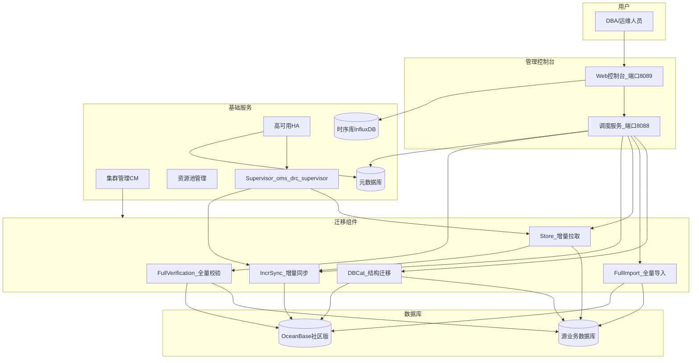
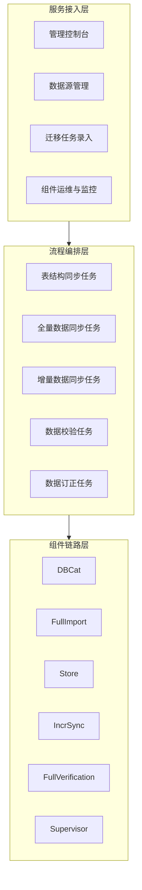
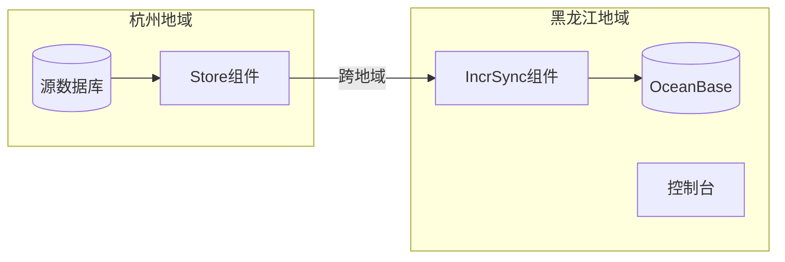
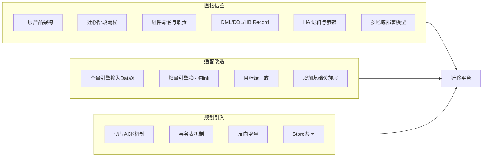

# OceanBase OMS 架构参考

> 本文档从《迁移平台总体设计》附录 C 拆出，供 SDD 与总体设计引用。

本附录基于 [OceanBase OMS 官方文档](https://github.com/oceanbase/oms-doc)（V4.2.5 社区版）整理，作为本平台设计的核心参考来源。阅读本附录有助于理解正文各模块命名与职责的 OMS 渊源，以及本平台与 OMS 的差异取舍。

### C.1 OMS 产品定位

OceanBase 迁移服务（OceanBase Migration Service，OMS）是 OceanBase 提供的**数据复制与迁移平台**，支持同构或异构 RDBMS 与 OceanBase 数据库之间的数据交互，核心能力包括：

| 能力 | 说明 |
|------|------|
| 在线迁移 | 业务不停机或短停机完成数据库迁移 |
| 实时同步 | 增量数据持续同步，保持源端与目标端一致 |
| 结构迁移 | 自动采集并转换 Schema，在目标端建表 |
| 数据校验 | 全字段对比，输出差异报告与订正 SQL |
| 反向增量 | 切换后可将目标端变更回流至源端（高级场景） |

**社区版约束**：目标端为 OceanBase 社区版；企业版支持更多数据源与高级特性。

### C.2 OMS 官方架构图

官方文档提供以下架构图（托管于阿里云 OSS，建议在浏览器中直接查看）：

| 图名 | 官方链接 | 内容 |
|------|----------|------|
| 系统架构总览 | [architecture5-zh.png](https://obbusiness-private.oss-cn-shanghai.aliyuncs.com/doc/img/oms/oms-enterprise/architecture5-zh.png) | 控制台、DBCat、Store、Full-Import、Incr-Sync、Full-Verification、基础服务 |
| 组件关系图 | [architecture11-zh.png](https://obbusiness-private.oss-cn-shanghai.aliyuncs.com/doc/img/oms/oms-enterprise/architecture11-zh.png) | 五大组件与 Supervisor 的协作关系 |
| 多节点 HA 架构 | [architecture7-zh.png](https://obbusiness-private.oss-cn-shanghai.aliyuncs.com/doc/img/oms/oms-enterprise/architecture7-zh.png) | 单地域多节点 Store/Incr-Sync 故障切换 |

#### C.2.1 系统架构文字还原（基于官方架构图）

### C.3 OMS 三层体系架构

OMS 从功能视角分为三层（参考 OceanBase 技术文章与官方文档综合）：

| 层次 | 职责 | 关键模块 |
|------|------|----------|
| **服务接入层** | 用户交互、数据源管理、任务配置、运维监控 | Web 控制台（8089）、调度服务（8088） |
| **流程编排层** | 实现迁移任务执行细节：结构同步、全量、增量、校验、订正 | 任务状态机、子任务依赖、预检查 |
| **组件链路层** | 实际执行数据读写与转换 | DBCat、Full-Import、Store、Incr-Sync、Full-Verification、Supervisor |

**本平台映射**：正文第 4 章「四层架构」在 OMS 三层基础上增加了独立的「基础设施层」，将 CM、资源池、HA、元数据库等从组件链路中剥离，便于通用化扩展。

### C.4 核心组件实现原理

#### C.4.1 DBCat — 结构迁移核心组件

DBCat 是 OceanBase 原生的 **Schema 转换引擎**，而非简单的 DDL 导出工具。

**工作原理**：

**支持的对象类型**：表、约束、索引、视图（及多种数据库对象，视源端/目标端类型而定）

**异构迁移处理的典型问题**：

| 问题 | DBCat 处理方式 |
|------|----------------|
| 数据库引擎变化 | 按目标端方言重写 DDL |
| 数据对象定义差异 | 逐对象类型转换规则 |
| 目标端不支持的对象 | 降级或跳过并告警 |
| 字段精度不匹配 | 选择最接近的兼容类型 |

**人工介入**：复杂异构场景下，DBCat 可生成基础脚本，由 DBA 人工加工后再执行。

#### C.4.2 Store — 增量拉取组件

Store 负责从源端数据库拉取增量日志，不同源端的实现方式不同：

| 源端类型 | Store 实现方式 |
|----------|----------------|
| OceanBase | 依赖 **Liboblog**：RPC 拉取各分区 Redo 日志 |
| MySQL | Binlog 拉取与解析 |
| Oracle | Redo/LogMiner 等 |
| 其他 | 按数据源适配 |

**Liboblog 工作流程**（OceanBase 源端）：

1. 通过 RPC 拉取 OceanBase 各分区的 Redo 日志
2. 结合表和列的 Schema 信息解析日志
3. 转换为 OMS 中间数据格式
4. 以事务方式输出修改数据

**Store 共享策略**：

| 场景 | Store 策略 |
|------|-----------|
| 迁移任务 | 每个迁移任务独立创建、管理、守护自己的 Store |
| 同步任务 | 同源端多任务可开启 Store 共享，HA 共同守护 |

#### C.4.3 Full-Import — 全量导入组件

Full-Import 是 OMS **自研**的全量迁移引擎（非 DataX），每张表经过四个步骤：

| 步骤 | 实现要点 |
|------|----------|
| 数据切片 | 根据表结构选择切片策略，单表并发迁移 |
| 数据读取 | 大部分数据源实现**流式读取**，降低源端压力 |
| 数据加工 | 类型转换、字符集处理等 |
| 数据应用 | **批量插入**；OB 分区表按分区写入聚合 |

**重启保障**：表内通过**切片位点 ACK 机制**确保重启后数据完整性。

**本平台差异**：本平台全量引擎选用 DataX，继承其 Reader-Channel-Writer 管道与 70+ 插件生态；ACK 机制可参考 OMS 在平台层实现。

#### C.4.4 Incr-Sync — 增量同步组件

Incr-Sync 将 Store 产生的增量数据应用至目标端。

**统一 Record 抽象**：

| Record 类型 | 内容 | 说明 |
|-------------|------|------|
| DML | INSERT / UPDATE / DELETE | 数据行变更 |
| DDL | ALTER TABLE 等 | 结构变更 |
| HB | Heartbeat | 心跳，用于延迟检测 |

**一致性保障机制**：

| 表类型 | 一致性策略 |
|--------|-----------|
| 有唯一约束（主键/唯一索引） | 利用主键操作**幂等性**确保最终一致 |
| 无主键表 | 通过**事务表机制**防止事务重放 |
| 无主键表（MySQL→OB MySQL 租户） | **不保证**最终一致性（官方限制） |

#### C.4.5 Full-Verification — 全量校验组件

| 特性 | 说明 |
|------|------|
| 对比方式 | 源端与目标端全字段对比，依赖索引信息做映射 |
| 读取方式 | 流式读取 + 表级切片，降低内存与源端压力 |
| 异构支持 | 内部数据格式化，屏蔽类型差异 |
| 多轮复检 | 降低增量延迟导致的误报 |
| 输出 | 差异数据文件 + 订正 SQL 文件 |

**触发时机**（官方迁移流程）：全量迁移完成且增量数据与源端基本追平后，自动发起一轮全量校验。

#### C.4.6 Supervisor — 组件监控

每台 OMS 机器运行 `oms_drc_supervisor` 代理组件：

- 定时向元数据库汇报心跳
- 监控 Store、Incr-Sync 等组件健康状态
- 配合 HA 模块触发故障恢复

### C.5 OMS 迁移任务标准流程

官方数据迁移任务包含以下阶段（以控制台创建任务为例）：

| 阶段 | OMS 行为 |
|------|----------|
| 预检查 | 检查用户读写权限、网络连通性等，全部通过才能启动 |
| 结构迁移 | DBCat 采集并转换 Schema，在目标端建表 |
| 全量迁移 | Full-Import 并发导入存量数据 |
| 增量同步 | Store 拉取 + Incr-Sync 写入，持续追平 |
| 全量校验 | 增量追平后自动发起，支持多轮复检 |
| 业务切换 | 切换应用到目标端 |
| 反向增量 | 将切换后目标端变更回流源端（可选） |

### C.6 OMS 高可用（HA）设计

#### C.6.1 容灾级别

| 容灾级别 | 是否支持 | 部署要求 |
|----------|----------|----------|
| 城市级容灾 | ❌ | — |
| 机房级容灾 | ✅ | 单地域多节点，跨机房部署 |
| 机器级容灾 | ✅ | 单地域至少 2 台机器 |
| 组件级容灾 | ✅ | 单节点亦可，异常组件重启/新建 |

> 容灾调度范围：**同地域内**，允许跨机房，**不允许跨地域**（就近读写原则）。

#### C.6.2 组件 HA 能力矩阵

| 组件 | HA 支持 | 机器宕机 | 组件异常 |
|------|---------|----------|----------|
| Store | ✅ | 在其他健康节点重建 | 尝试新建 Store |
| Incr-Sync | ✅ | 在同地域其他节点重建 | 重启进程（10 分钟冷却） |
| Full-Import | ❌ | 需人工重试 | 需人工重试 |
| Full-Verification | ❌ | 需人工重试 | 需人工重试 |

#### C.6.3 机器宕机 HA 流程（Incr-Sync）

1. `oms_drc_supervisor` 停止心跳 → 超过 `checkHostDownIntervalSec`（默认 540s）判定宕机
2. 查询宕机机器上 Incr-Sync 任务列表，分为「运行中」与「其他」
3. 在同地域其他健康机器上**重建所有 Incr-Sync 组件**，删除宕机机器上的注册信息
4. 原「运行中」的组件在新机器上启动；非运行中保持原状态

**注意**：宕机恢复后可能出现 Incr-Sync **双写**目标端的情况。

#### C.6.4 Store HA 逻辑

| 条件 | HA 行为 |
|------|---------|
| Store 数量为 0 | 不干预 |
| 全部 Store 已停止（用户手工） | 不干预 |
| Store 数量达到上限（`subtopicStoreNumberThreshold`，默认 5） | 不干预，放弃 HA |
| 无运行中 Store | 尝试新建 Store |
| 运行中 Store 数据无法满足下游消费 | 且 `perceiveStoreClientCheckpoint=true` 时，新建 Store |

**新建 Store 启动位点计算**：

| 配置 | 启动位点 |
|------|----------|
| `perceiveStoreClientCheckpoint=false` | 当前时间 − `refetchStoreIntervalMin`（默认 30 分钟） |
| `perceiveStoreClientCheckpoint=true` | 下游最早消费位点 − `refetchStoreIntervalMin` |

#### C.6.5 HA 配置参数表（`ha.config`）

在 OMS 控制台 **系统管理 → 系统参数** 中搜索 `ha.config` 查看和编辑：

| 范围 | 配置项 | 类型 | 默认值 | 说明 |
|------|--------|------|--------|------|
| 全局控制 | `enable` | Boolean | false | HA 总开关 |
| 全局控制 | `checkRequestIntervalSec` | Integer | 600 | 同一对象 HA 操作最小间隔（秒） |
| 机器宕机 | `enableHost` | Boolean | false | 机器宕机 HA 开关 |
| 机器宕机 | `checkHostDownIntervalSec` | Integer | 540 | 宕机判定阈值（秒） |
| 组件异常(Store) | `enableStore` | Boolean | true | Store HA 开关 |
| 组件异常(Store) | `checkModuleExceptionIntervalSec` | Integer | 240 | Store 异常判定阈值（秒） |
| 组件异常(Store) | `subtopicStoreNumberThreshold` | Integer | 5 | 单任务-数据源最大 Store 数 |
| 组件异常(Store) | `refetchStoreIntervalMin` | Integer | 30 | 新建 Store 位点回退分钟数 |
| 组件异常(Store) | `perceiveStoreClientCheckpoint` | Boolean | false | 是否感知下游消费位点 |
| 组件异常(Store) | `clearAbnormalResourceHours` | Integer | 72 | 异常 Store 清理阈值（小时） |
| 组件异常(Incr-Sync) | `enableConnector` | Boolean | true | Incr-Sync HA 开关 |

> HA 功能**默认关闭**，需在控制台手动开启。

**本平台借鉴**：正文第 10.2 节 HA 设计直接参考上述逻辑；V2 阶段实现时应将等效参数纳入平台系统配置。

### C.7 OMS 部署架构要点

#### C.7.1 端口与角色

| 端口 | 用途 |
|------|------|
| 8089 | Web 控制台访问 |
| 8088 | 调度服务 |

#### C.7.2 集群管理（CM）关键配置

| 配置项 | 说明 |
|--------|------|
| `cm_url` | 集群管理服务地址（多节点用 VIP/域名） |
| `cm_nodes` | CM 机器 IP 列表 |
| `cm_region` / `cm_region_cn` | 地域标识 |
| `cm_is_default` | 是否默认 CM 集群（多地域仅一个为 true） |
| `oms_meta_host` 等 | 元数据库连接信息 |
| `drc_rm_db` / `drc_cm_db` / `drc_cm_heartbeat_db` | OMS 在元库中创建的三个库 |
| `tsdb_service` | 时序库类型（INFLUXDB / CERESDB） |

#### C.7.3 多地域部署原则

跨地域同步示例（杭州 → 黑龙江）：

- Store 部署在**源端地域**（杭州）
- Incr-Sync 部署在**目标端地域**（黑龙江）
- 每个地域至少一台机器执行 `docker_init.sh`
- 多地域仅一个 `cm_is_default=true`

### C.8 OMS 与本平台逐项差异对照

| 维度 | OceanBase OMS | 本平台设计 | 差异原因 |
|------|---------------|-----------|----------|
| 目标端 | 绑定 OceanBase | 开放多种目标库 | 通用平台定位 |
| 全量引擎 | 自研 Full-Import | 基于 DataX | 复用 70+ 异构插件 |
| 增量引擎 | 自研 Store + Incr-Sync | Flink CDC + Store 抽象 | 复用 Flink Exactly-once 与 Connector 生态 |
| 结构迁移 | 自研 DBCat（OB 原生） | SchemaEngine（借鉴 DBCat） | 需支持非 OB 目标端映射 |
| 架构分层 | 三层（接入/编排/组件） | 四层（+基础设施层） | 解耦资源管理与执行引擎 |
| Record 格式 | DML/DDL/HB | 沿用 DML/DDL/HB | 直接借鉴 |
| 切片 ACK | Full-Import 内置 | 平台层参考实现 | DataX 无原生 ACK，需补充 |
| 事务表机制 | Incr-Sync 内置（无主键表） | V2 参考实现 | 无主键表一致性 |
| 反向增量 | ✅ 原生支持 | V3 规划 | 高级场景 |
| Store 共享 | 同步任务支持 | V2 规划 | 降低源端压力 |
| HA 默认 | 关闭，需手动开启 | V2 实现，建议默认开启 | 产品策略差异 |
| 时序监控 | InfluxDB/CeresDB | Prometheus/InfluxDB | 开源生态选择 |
| 部署 | Docker + CM 集群 | K8s/YARN/物理机 + 自建 CM | 云原生导向 |

### C.9 本平台对 OMS 的借鉴总结

| 借鉴等级 | 内容 |
|----------|------|
| **直接复用** | 迁移阶段划分、组件职责划分、Record 抽象、HA 容灾模型、预检查流程 |
| **适配改造** | 全量/增量引擎技术选型、目标端开放、架构分层扩展 |
| **后续引入** | 切片 ACK、事务表、反向增量、Store 共享、智能订正 |

