# 迁移平台总体设计

| 属性 | 说明 |
|------|------|
| 文档版本 | v1.1 |
| 创建日期 | 2026-07-09 |
| 适用范围 | 通用异构数据迁移平台 |
| 参考来源 | [DataX 设计框架与模块分析](DataX设计框架与模块分析.docx)、[Flink 设计框架与模块总结](Flink设计框架与模块总结.docx)、[OceanBase OMS 架构文档](https://github.com/oceanbase/oms-doc) |

---

## 1. 文档说明

本文档在分析 DataX、Apache Flink 与 OceanBase OMS 三套系统的设计基础上，提出一套**通用异构数据迁移平台**的总体架构设计。平台以 OMS 的产品化迁移流程为骨架，以 DataX 承担全量离线同步，以 Flink CDC 承担增量实时同步，形成端到端的在线迁移能力。

**设计定位**：

- 支持多种源端与目标端数据库（MySQL、Oracle、PostgreSQL、OceanBase、HBase 等）
- 覆盖结构迁移、全量迁移、增量同步、数据校验、业务切换全流程
- 提供可视化控制台与 OpenAPI，降低迁移运维成本

---

## 2. 背景与目标

### 2.1 背景

企业在数据库升级、云迁移、架构转型（集中式 → 分布式）过程中，面临以下挑战：

| 挑战 | 说明 |
|------|------|
| 异构数据源 | 源端与目标端数据库类型、方言、数据类型差异大 |
| 停机窗口有限 | 业务要求在线迁移，尽量减少停机时间 |
| 数据一致性 | 全量与增量需无缝衔接，迁移后数据必须可校验 |
| 运维复杂度 | 多阶段任务编排、监控、故障恢复需要统一平台 |

现有开源方案各有侧重：

- **DataX**：擅长异构全量离线同步，但不支持增量与结构迁移
- **Flink CDC**：擅长实时增量同步与 Exactly-once，但缺少产品化编排
- **OceanBase OMS**：提供完整迁移产品能力，但目标端绑定 OceanBase

### 2.2 设计目标

| 目标 | 指标 |
|------|------|
| 端到端迁移 | 结构 → 全量 → 增量 → 校验 → 切换，一站式完成 |
| 低停机 | 增量同步期间业务可继续写入源端 |
| 数据一致性 | 全量位点与增量位点精确衔接，支持全字段校验 |
| 高可用 | Store/Incr-Sync 组件支持 HA，故障自动切换 |
| 可扩展 | 插件化 Reader/Writer/CDC Connector，快速接入新数据源 |
| 可观测 | 任务进度、吞吐、延迟、脏数据、差异数据全程可监控 |

---

## 3. 设计原则

### 3.1 核心原则

1. **分层解耦**：接入层、编排层、执行层、基础设施层职责清晰，各层可独立演进
2. **双引擎互补**：全量用 DataX（离线高吞吐），增量用 Flink CDC（实时 Exactly-once）
3. **插件即插即用**：新增数据源只需实现 Reader/Writer 或 CDC Connector
4. **流程驱动**：以状态机编排迁移阶段，子任务可并行、可重试、可回滚
5. **统一数据模型**：增量 Record 抽象为 DML/DDL/HB，屏蔽源端差异

### 3.2 三大参考系统对照

| 设计原则 | DataX | Flink | OMS | 本平台采纳 |
|----------|-------|-------|-----|-----------|
| 架构模式 | Framework + Plugin | 分层 API/Runtime | 三层产品架构 | 四层 + 双引擎 |
| 数据传输 | Reader → Channel → Writer | Source → Operator → Sink | Store → Incr-Sync | 全量走 Channel，增量走 Flink 流 |
| 并发模型 | Task/TaskGroup/Channel | Slot/Task/算子链 | 组件级并发 | 全量表级并行，增量单链路 |
| 容错机制 | Task Failover + 脏数据限制 | Checkpoint + Savepoint | 组件 HA + Supervisor | 三者融合 |
| 扩展方式 | plugin.json 注册 | Connector SPI | 有限内置 | 统一插件注册中心 |

---

## 4. 总体架构设计

### 4.1 架构概览

平台采用 **四层架构 + 数据平面** 模型：

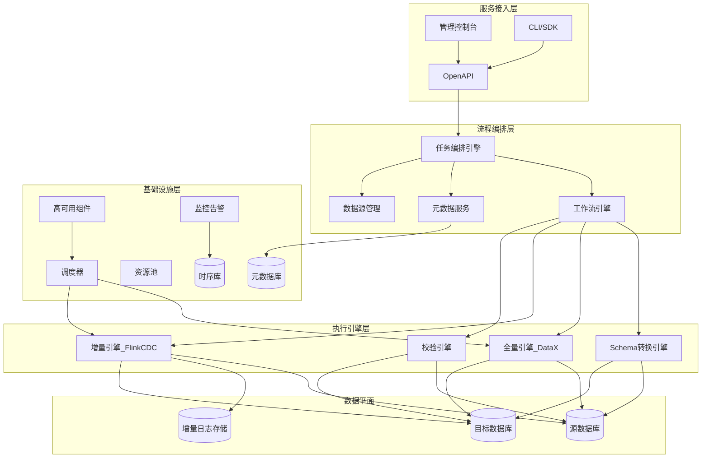

### 4.2 各层职责

| 层次 | 参考来源 | 核心职责 |
|------|----------|----------|
| **服务接入层** | OMS 控制台 | 任务创建与配置、数据源管理、进度监控、告警通知、权限控制 |
| **流程编排层** | OMS 编排 + Flink JobGraph | 迁移流水线编排、子任务状态机、元数据管理、任务调度决策 |
| **执行引擎层** | DataX + Flink + OMS 组件 | 结构转换、全量导入、增量拉取与同步、数据校验的具体执行 |
| **基础设施层** | OMS CM/HA + Flink RM | 集群管理、资源池、组件注册、高可用切换、指标采集与存储 |
| **数据平面** | — | 源端数据库、目标端数据库、增量日志中间存储 |

### 4.3 控制平面与数据平面分离

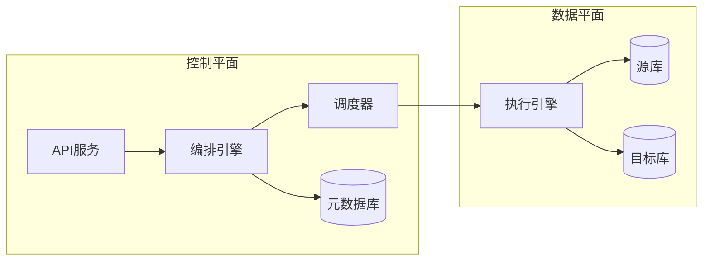

控制平面负责决策与元数据管理，数据平面负责实际数据读写，两者通过调度器解耦，便于独立扩缩容。

---

## 5. 模块组成与职责

### 5.1 模块组成总览

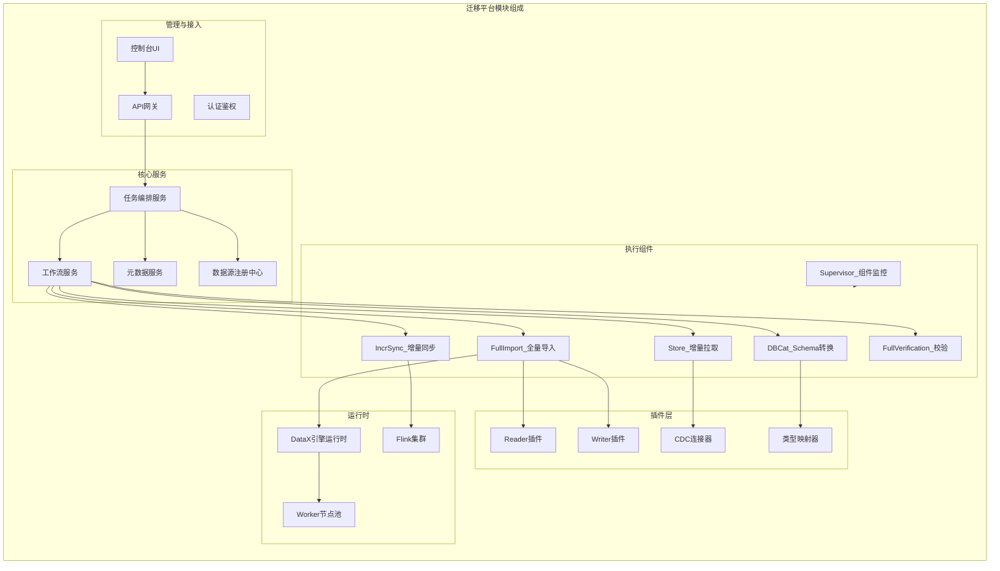

### 5.2 模块职责详述

#### 5.2.1 管理与接入模块

| 模块 | 职责 | 关键能力 |
|------|------|----------|
| 控制台 UI | Web 管理界面 | 任务向导、进度大盘、日志查看、告警配置 |
| API 网关 | 统一入口 | RESTful API、限流、鉴权、版本管理 |
| 认证鉴权 | 安全控制 | RBAC 权限、多租户隔离、操作审计 |

#### 5.2.2 核心服务模块

| 模块 | 职责 | 关键能力 |
|------|------|----------|
| 任务编排服务 | 迁移任务全生命周期管理 | 创建/启动/暂停/恢复/终止任务 |
| 工作流服务 | 子任务流水线编排 | 状态机驱动、依赖管理、并行策略 |
| 元数据服务 | 配置与状态持久化 | 任务配置、位点、映射关系、统计指标 |
| 数据源注册中心 | 连接信息管理 | 连接池、连通性检测、凭证加密存储 |

#### 5.2.3 执行组件（借鉴 OMS）

| 组件 | 参考 | 职责 | HA 支持 |
|------|------|------|---------|
| **DBCat** | OMS DBCat | 源端 Schema 采集、类型映射、目标端 DDL 生成与执行 | 否 |
| **FullImport** | OMS Full-Import + DataX | 全量数据切片、并发读取、写入目标端 | 否 |
| **Store** | OMS Store | 源端增量日志拉取、解析、持久化 | **是** |
| **IncrSync** | OMS Incr-Sync + Flink | 增量 Record 应用至目标端 | **是** |
| **FullVerification** | OMS Full-Verification | 源/目标数据分片对比、差异报告 | 否 |
| **Supervisor** | OMS Supervisor | 组件健康监控、异常检测、HA 触发 | — |

#### 5.2.4 插件层

| 插件类型 | 参考 | 接口规范 | 示例 |
|----------|------|----------|------|
| Reader | DataX SPI | `Job.init/split` + `Task.startRead` | mysqlreader, oraclereader |
| Writer | DataX SPI | `Job.init/split` + `Task.startWrite` | mysqlwriter, oceanbasewriter |
| CDC Connector | Flink FLIP-27 | `Source/Sink` + SplitEnumerator | mysql-cdc, oracle-cdc |
| TypeMapper | OMS DBCat | `mapType(source, target)` | oracle-to-ob, mysql-to-pg |
| Transformer | DataX | `evaluate(Record)` | 脱敏、过滤、类型转换 |

#### 5.2.5 运行时

| 运行时 | 职责 | 部署方式 |
|--------|------|----------|
| DataX 引擎 | 执行全量同步 Job | 内嵌或独立 Worker 进程 |
| Flink 集群 | 执行增量 CDC 作业 | Session/Application 模式 |
| Worker 节点池 | 资源隔离与弹性调度 | K8s/YARN/物理机 |

---

## 6. 迁移任务生命周期与状态机

### 6.1 标准迁移流程

一次完整的在线迁移包含以下阶段：

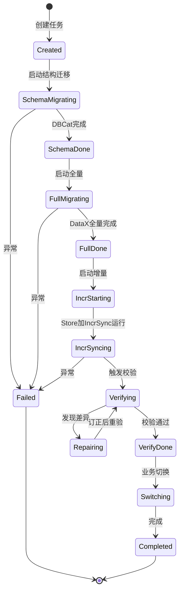

### 6.2 任务模型

```text
MigrationProject（迁移项目）
  └── MigrationTask（迁移任务，一对源→目标）
        ├── SubTask: SchemaMigration（结构迁移）
        ├── SubTask: FullMigration（全量迁移，可按表并行）
        ├── SubTask: IncrementalSync（增量同步，单链路）
        ├── SubTask: Verification（数据校验，可按表并行）
        └── SubTask: Switchover（业务切换）
```

### 6.3 阶段衔接要点

| 阶段转换 | 衔接机制 |
|----------|----------|
| 结构 → 全量 | 结构迁移完成后锁定表结构，全量按映射后的表名读取 |
| 全量 → 增量 | 全量开始时记录 binlog/redo 位点；全量结束后从该位点开始增量 |
| 增量 → 校验 | 等待增量延迟降至阈值后触发校验，支持多轮复检 |
| 校验 → 切换 | 校验通过后执行 DNS/连接串切换，停止源端写入 |

### 6.4 子任务并行策略


---

## 7. 核心数据流

### 7.1 结构迁移数据流（DBCat）


**处理对象**：表、索引、约束、视图、序列、存储过程（按目标端支持情况）

**类型映射示例**：

| 源端 (Oracle) | 目标端 (OceanBase) | 映射策略 |
|---------------|-------------------|----------|
| NUMBER(p,s) | DECIMAL(p,s) | 精确映射 |
| VARCHAR2(n) | VARCHAR(n) | 直接映射 |
| CLOB | TEXT | 直接映射 |
| BFILE | BLOB | 降级映射 |

### 7.2 全量迁移数据流（DataX）

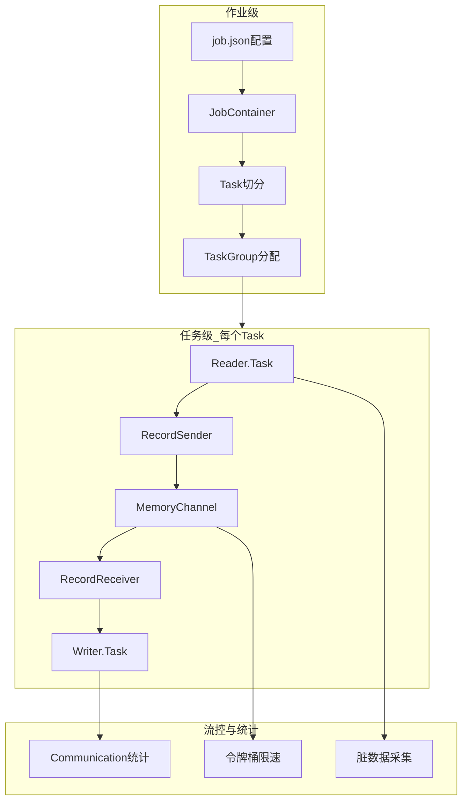

**关键设计**（继承 DataX）：

- 严格 **1:1 Reader-Writer Task 配对**
- **Writer 先启动**，防止 Reader 提前结束导致数据丢失
- Channel 数 ≠ Task 数：Task 排队执行，Channel 限制 TaskGroup 内并发
- 平台根据任务配置**自动生成** DataX `job.json`

**全量并发示例**：

> 100 张分表从 MySQL 同步到目标库，配置 20 并发：平台切分为 100 个 Task，分配 4 个 TaskGroup（20 ÷ 5 = 4），每个 TaskGroup 以 5 个 Channel 并发执行。

### 7.3 增量同步数据流（Flink CDC）

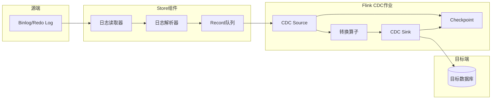

**统一增量 Record 格式**（借鉴 OMS）：

| Record 类型 | 说明 | 示例 |
|-------------|------|------|
| DML | 数据变更 | INSERT / UPDATE / DELETE |
| DDL | 结构变更 | ALTER TABLE / CREATE INDEX |
| HB | 心跳 | 用于延迟检测与位点推进 |

**位点管理**：

- 全量开始时记录源端 binlog/redo 位点（`startPosition`）
- 全量结束后，Store 从 `startPosition` 开始拉取增量
- Flink Checkpoint 持久化消费位点，故障后从最近 Checkpoint 恢复

### 7.4 数据校验数据流

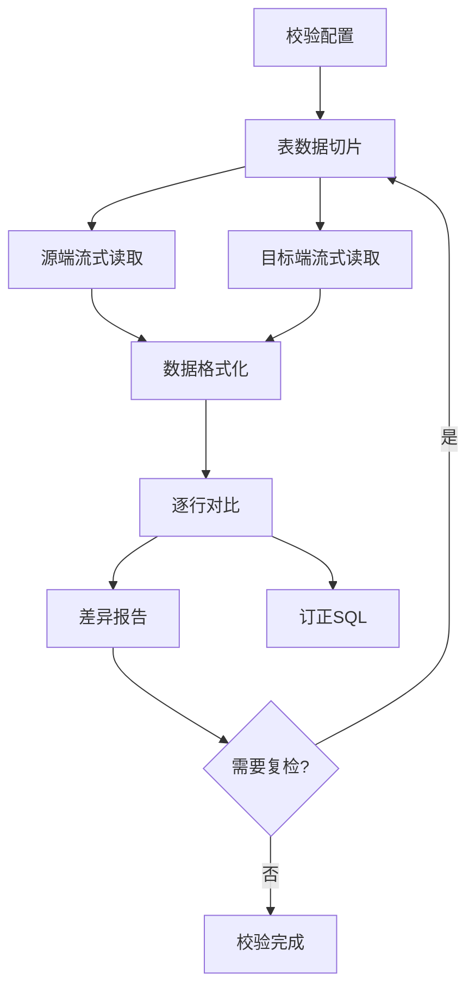

**校验策略**：

- 按主键/索引分片并行对比，降低单点压力
- 流式读取，避免大表全量加载到内存
- 支持多轮复检，降低增量延迟导致的误报
- 输出差异数据文件与订正 SQL

---

## 8. 插件与连接器体系

### 8.1 插件注册机制

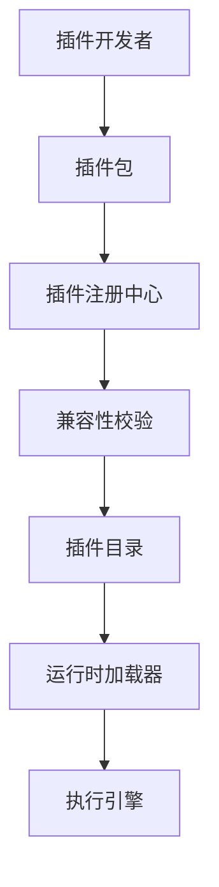

**DataX 风格插件结构**：

```text
plugin/reader/mysqlreader/
  ├── plugin.json          # 插件元信息
  ├── plugin_job_template.json
  └── mysqlreader-0.0.1-SNAPSHOT.jar
```

**Flink CDC Connector 结构**：

```text
connectors/flink-sql-connector-mysql-cdc/
  ├── META-INF/services/org.apache.flink.table.factories.Factory
  └── flink-sql-connector-mysql-cdc-3.x.jar
```

### 8.2 插件 SPI 接口

#### Reader/Writer（DataX）

```java
// Reader 插件 SPI
public abstract class Reader {
    public static class Job {
        void init();
        List<Configuration> split(int adviceNumber);
        void post();
        void destroy();
    }
    public static class Task {
        void init();
        void startRead(RecordSender recordSender);
        void post();
        void destroy();
    }
}
```

#### CDC Connector（Flink FLIP-27）

```java
// 统一 Source 框架
public interface Source<T, SplitT, EnumChkT> {
    Boundedness getBoundedness();
    SourceReader<T, SplitT> createReader(...);
    SplitEnumerator<SplitT, EnumChkT> createEnumerator(...);
    SourceSerializer<SplitT> getSplitSerializer();
    EnumeratorCheckpointSerializer<EnumChkT> getEnumeratorCheckpointSerializer();
}
```

### 8.3 插件能力矩阵

| 数据源 | Reader | Writer | CDC | TypeMapper |
|--------|--------|--------|-----|------------|
| MySQL | ✅ | ✅ | ✅ | ✅ |
| Oracle | ✅ | ✅ | ✅ | ✅ |
| PostgreSQL | ✅ | ✅ | ✅ | ✅ |
| OceanBase | ✅ | ✅ | ✅ | ✅ |
| SQL Server | ✅ | ✅ | 🔲 | ✅ |
| MongoDB | ✅ | ✅ | 🔲 | 🔲 |
| HBase | ✅ | ✅ | — | — |
| HDFS/Hive | ✅ | ✅ | — | — |

> ✅ 已支持 / 🔲 规划中 / — 不适用

---

## 9. 调度与资源管理

### 9.1 调度架构

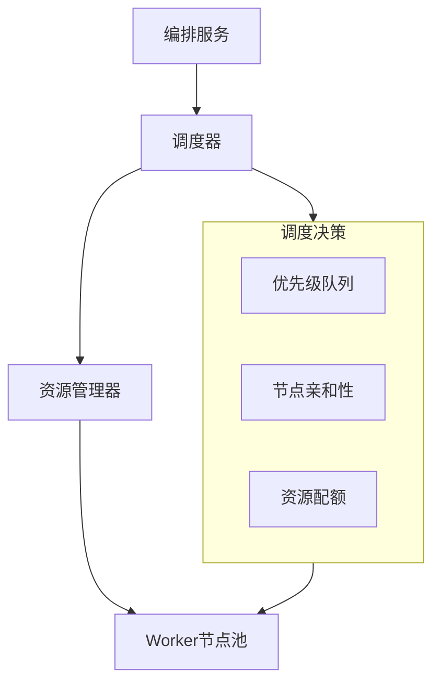

### 9.2 资源模型

| 资源类型 | 分配单位 | 说明 |
|----------|----------|------|
| DataX Worker | 进程/容器 | 每个全量 Job 占用一个 Worker |
| Flink Slot | Slot | 每个增量作业占用若干 Slot |
| CPU/内存 | 配额 | 按租户/项目限制资源上限 |

### 9.3 调度策略

| 策略 | 适用场景 |
|------|----------|
| 公平调度 | 多租户场景，按配额分配 |
| 优先级调度 | 紧急迁移任务优先执行 |
| 亲和调度 | Store 部署在源端就近节点，IncrSync 部署在目标端 |
| 弹性调度 | 根据任务队列深度自动扩缩 Worker |

---

## 10. 容错、监控与运维

### 10.1 容错机制

| 层级 | 机制 | 参考来源 |
|------|------|----------|
| Task 级 | Failover 重试（maxRetryTimes） | DataX |
| 作业级 | Checkpoint + Savepoint 恢复 | Flink |
| 组件级 | Store/IncrSync HA 自动切换 | OMS |
| 数据级 | 脏数据上限（errorLimit）+ 差异订正 | DataX + OMS |

### 10.2 组件 HA 设计（参考 OMS）

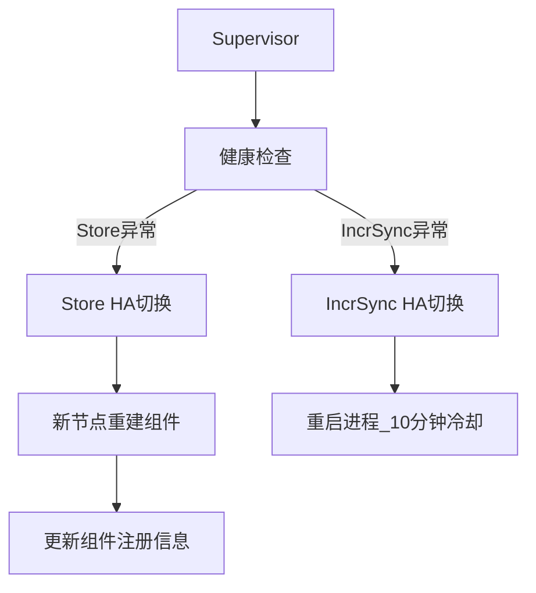

| 组件 | HA 支持 | 异常行为 |
|------|---------|----------|
| Store | ✅ | 宕机后在其他健康节点重建，删除旧注册 |
| IncrSync | ✅ | 尝试重启，10 分钟冷却期 |
| FullImport | ❌ | 失败后人工重试 |
| FullVerification | ❌ | 失败后人工重试 |

### 10.3 监控指标

| 类别 | 指标 | 来源 |
|------|------|------|
| 吞吐 | byteSpeed、recordSpeed | DataX Communication |
| 延迟 | 增量同步延迟（秒） | Store → IncrSync |
| 进度 | 已完成表数/总表数、已迁移行数 | 编排层统计 |
| 质量 | 脏数据数、差异数据数 | DataX + Verification |
| 资源 | CPU、内存、Channel 使用率 | Worker/Flink 监控 |
| 健康 | 组件状态、心跳 | Supervisor |

### 10.4 告警规则

| 告警项 | 条件 | 级别 |
|--------|------|------|
| 任务失败 | 子任务状态变为 Failed | P0 |
| 增量延迟过高 | 延迟 > 60s 持续 5min | P1 |
| 脏数据超限 | 脏数据占比 > errorLimit | P1 |
| 校验差异 | 差异行数 > 0 | P2 |
| 组件异常 | Supervisor 检测到组件不可用 | P0 |

---

## 11. 部署架构

### 11.1 单机开发模式

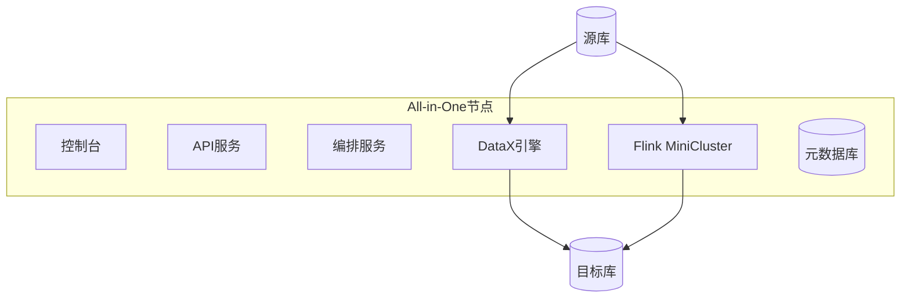

适用场景：开发调试、PoC 验证。

### 11.2 单地域多节点（参考 OMS）

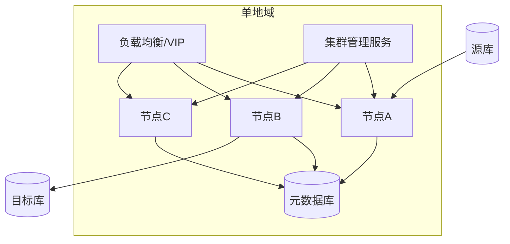

- Store/Incr-Sync 支持 HA：节点 A 故障时自动切换至 B 或 C
- 集群管理服务（CM）负责组件注册与调度
- 控制台通过 VIP 访问，端口 8089

### 11.3 多地域部署

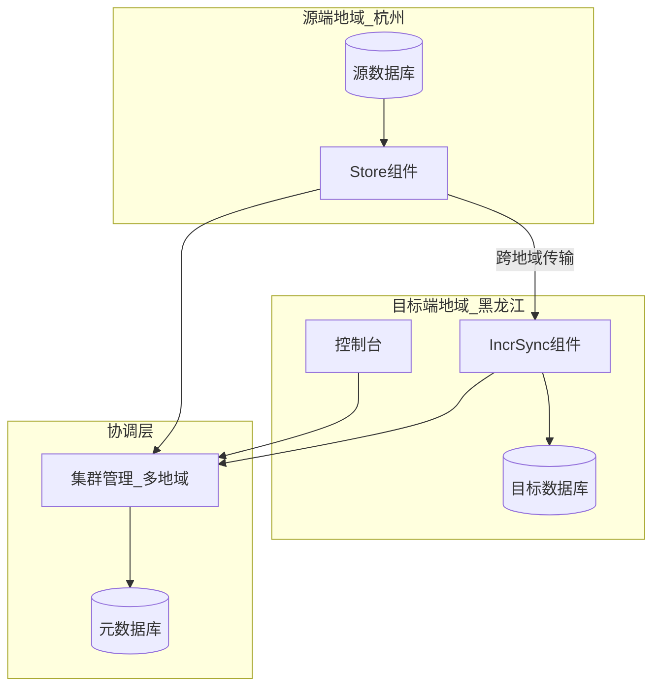

适用场景：跨地域容灾、异地多活。Store 部署在源端地域，IncrSync 部署在目标端地域。

---

## 12. 技术选型建议

| 模块 | 建议技术 | 理由 |
|------|----------|------|
| 后端服务 | Java 17 + Spring Boot 3 | 与 DataX/Flink 生态一致，成熟稳定 |
| 全量引擎 | 内嵌/调度 DataX | 70+ 插件，成熟异构离线同步 |
| 增量引擎 | Apache Flink + CDC Connectors | 分布式流处理，Exactly-once 语义 |
| 前端控制台 | React + Ant Design | 任务管理、监控大盘 |
| API 网关 | Spring Cloud Gateway | 鉴权、限流、路由 |
| 元数据库 | MySQL 8 / PostgreSQL | 任务配置、位点、映射关系持久化 |
| 时序数据库 | Prometheus / InfluxDB | 指标存储与查询 |
| 监控告警 | Prometheus + Grafana + AlertManager | 指标采集、可视化、告警 |
| 协调服务 | ZooKeeper / etcd | HA 选主、组件注册 |
| 消息队列 | Kafka（可选） | Store 与 IncrSync 之间解耦 |
| 容器编排 | Kubernetes | 弹性调度、多节点部署 |

---

## 13. 与 DataX / Flink / OMS 的能力映射

### 13.1 能力对照总表

| 能力 | DataX | Flink CDC | OMS | 本平台 |
|------|-------|-----------|-----|--------|
| 结构迁移 | ❌ | 部分 | ✅ DBCat | ✅ SchemaEngine |
| 全量迁移 | ✅ 核心 | ✅ | ✅ Full-Import | ✅ BatchEngine (DataX) |
| 增量同步 | ❌ | ✅ 核心 | ✅ Store+IncrSync | ✅ StreamEngine (Flink) |
| 数据校验 | ❌ | ❌ | ✅ Full-Verification | ✅ VerifyEngine |
| 可视化运维 | ❌ | Flink Web UI | ✅ 控制台 | ✅ 统一控制台 |
| 插件扩展 | ✅ 70+ | ✅ Connector 生态 | 有限 | ✅ 统一插件注册中心 |
| Exactly-once | ❌ | ✅ | ✅ | ✅ |
| 多地域 | ❌ | ✅ | ✅ | ✅ (V3) |
| HA | ❌ | ✅ | ✅ Store/IncrSync | ✅ |

### 13.2 架构模式映射

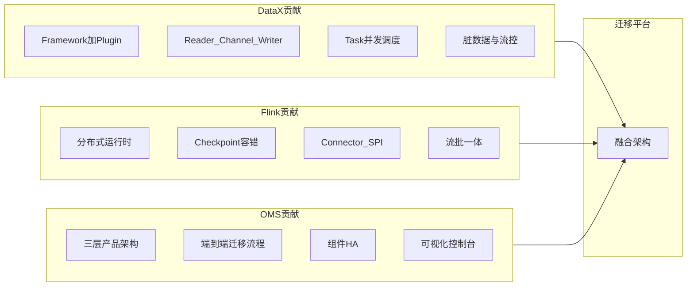

### 13.3 关键设计决策

| 决策 | 选择 | 理由 |
|------|------|------|
| 双引擎 vs 单引擎 | 双引擎（DataX + Flink） | 全量与增量场景差异大，各取所长 |
| OMS 三层 vs 自建 | 借鉴三层，引擎开放 | 保留产品化能力，不绑定目标端 |
| 插件隔离 | ClassLoader 隔离（DataX 模式） | 避免依赖冲突 |
| 增量 Record 格式 | 统一 DML/DDL/HB（OMS 模式） | 屏蔽源端差异，简化 IncrSync |
| 部署模式 | 支持单机/多节点/多地域 | 从业余到生产的完整路径 |

---

## 14. 演进路线

### 14.1 版本规划

| 阶段 | 范围 | 核心交付 |
|------|------|----------|
| **MVP** | 基础迁移能力 | 控制台 + 单源单目标 + 全量 (DataX) + 基础监控 |
| **V1** | 在线迁移 | 增量 (Flink CDC) + 结构迁移 (DBCat) + 任务编排 |
| **V2** | 企业级 | 数据校验 + 组件 HA + 多租户 + RBAC |
| **V3** | 高级场景 | 多地域部署 + 灰度切换 + 智能订正 + 性能调优 |

### 14.2 MVP 架构

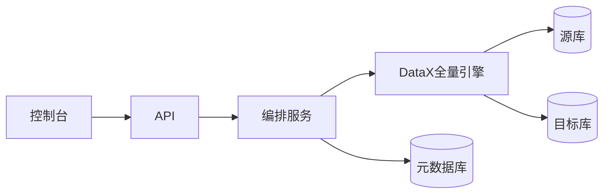

### 14.3 V1 架构

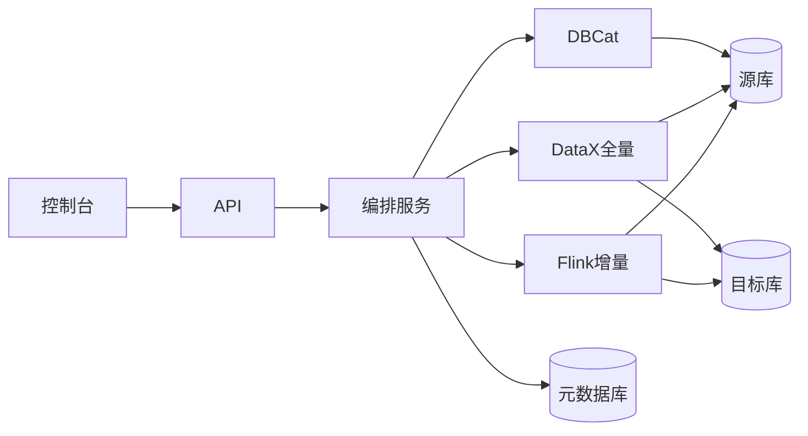

---

## 附录 A：术语表

| 术语 | 说明 |
|------|------|
| DBCat | Schema 采集与转换组件，借鉴 OMS DBCat |
| Store | 增量日志拉取组件，从源端 binlog/redo 读取变更 |
| IncrSync | 增量同步组件，将变更应用至目标端 |
| FullImport | 全量数据导入组件，基于 DataX 实现 |
| FullVerification | 全量数据校验组件 |
| Supervisor | 组件健康监控与 HA 触发 |
| Channel | DataX 中 Reader 与 Writer 之间的数据传输通道 |
| Checkpoint | Flink 分布式快照，用于故障恢复 |
| Record | 统一数据行抽象，全量用 DataX Record，增量用 DML/DDL/HB |

## 附录 B：参考文档

1. [DataX 设计框架与模块分析](DataX设计框架与模块分析.docx) — 本仓库
2. [Flink 设计框架与模块总结](Flink设计框架与模块总结.docx) — 本仓库
3. [OceanBase OMS 架构概览](https://github.com/oceanbase/oms-doc/blob/V4.2.5/zh-CN/200.product-introduction/300.architecture/100.architecture-overview.md)
4. [OceanBase OMS 组件基本原理](https://github.com/oceanbase/oms-doc/blob/V4.2.5/zh-CN/200.product-introduction/300.architecture/300.basic-principles-of-components.md)
5. [OceanBase OMS HA 介绍](https://github.com/oceanbase/oms-doc/blob/V4.2.5/zh-CN/200.product-introduction/210.oms-ha-intro.md)
6. [Alibaba DataX GitHub](https://github.com/alibaba/DataX)
7. [Apache Flink 官方文档](https://flink.apache.org/)
8. [OceanBase OMS 多节点部署](https://github.com/oceanbase/oms-doc/blob/V4.2.5/zh-CN/400.deployment-guide/600.deploy-oms-on-multiple-nodes-in-a-single-region.md)
9. [OceanBase OMS 多地域部署](https://github.com/oceanbase/oms-doc/blob/V4.2.5/zh-CN/400.deployment-guide/700.deploy-oms-on-multiple-nodes-in-multiple-regions.md)

## 附录 C：OceanBase OMS 架构深度参考

本附录基于 [OceanBase OMS 官方文档](https://github.com/oceanbase/oms-doc)（V4.2.5 社区版）整理，作为本平台设计的核心参考来源。阅读本附录有助于理解正文各模块命名与职责的 OMS 渊源，以及本平台与 OMS 的差异取舍。

### C.1 OMS 产品定位

OceanBase 迁移服务（OceanBase Migration Service，OMS）是 OceanBase 提供的**数据复制与迁移平台**，支持同构或异构 RDBMS 与 OceanBase 数据库之间的数据交互，核心能力包括：

| 能力 | 说明 |
|------|------|
| 在线迁移 | 业务不停机或短停机完成数据库迁移 |
| 实时同步 | 增量数据持续同步，保持源端与目标端一致 |
| 结构迁移 | 自动采集并转换 Schema，在目标端建表 |
| 数据校验 | 全字段对比，输出差异报告与订正 SQL |
| 反向增量 | 切换后可将目标端变更回流至源端（高级场景） |

**社区版约束**：目标端为 OceanBase 社区版；企业版支持更多数据源与高级特性。

### C.2 OMS 官方架构图

官方文档提供以下架构图（托管于阿里云 OSS，建议在浏览器中直接查看）：

| 图名 | 官方链接 | 内容 |
|------|----------|------|
| 系统架构总览 | [architecture5-zh.png](https://obbusiness-private.oss-cn-shanghai.aliyuncs.com/doc/img/oms/oms-enterprise/architecture5-zh.png) | 控制台、DBCat、Store、Full-Import、Incr-Sync、Full-Verification、基础服务 |
| 组件关系图 | [architecture11-zh.png](https://obbusiness-private.oss-cn-shanghai.aliyuncs.com/doc/img/oms/oms-enterprise/architecture11-zh.png) | 五大组件与 Supervisor 的协作关系 |
| 多节点 HA 架构 | [architecture7-zh.png](https://obbusiness-private.oss-cn-shanghai.aliyuncs.com/doc/img/oms/oms-enterprise/architecture7-zh.png) | 单地域多节点 Store/Incr-Sync 故障切换 |

#### C.2.1 系统架构文字还原（基于官方架构图）

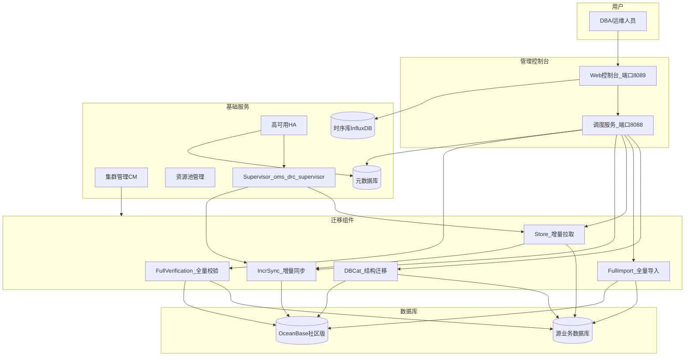

### C.3 OMS 三层体系架构

OMS 从功能视角分为三层（参考 OceanBase 技术文章与官方文档综合）：

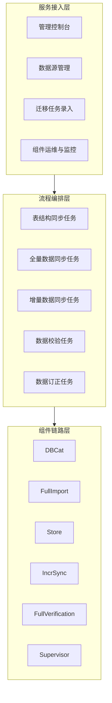

| 层次 | 职责 | 关键模块 |
|------|------|----------|
| **服务接入层** | 用户交互、数据源管理、任务配置、运维监控 | Web 控制台（8089）、调度服务（8088） |
| **流程编排层** | 实现迁移任务执行细节：结构同步、全量、增量、校验、订正 | 任务状态机、子任务依赖、预检查 |
| **组件链路层** | 实际执行数据读写与转换 | DBCat、Full-Import、Store、Incr-Sync、Full-Verification、Supervisor |

**本平台映射**：正文第 4 章「四层架构」在 OMS 三层基础上增加了独立的「基础设施层」，将 CM、资源池、HA、元数据库等从组件链路中剥离，便于通用化扩展。

### C.4 核心组件实现原理

#### C.4.1 DBCat — 结构迁移核心组件

DBCat 是 OceanBase 原生的 **Schema 转换引擎**，而非简单的 DDL 导出工具。

**工作原理**：

```mermaid
flowchart LR
    Collect[源端元数据采集] --> Parse[对象定义解析]
    Parse --> Map[类型映射与转换]
    Map --> Align[OB租户兼容性对齐]
    Align --> GenDDL[生成目标端DDL]
    GenDDL --> Execute[目标端执行]
    Execute --> Meta[映射元数据持久化]
```

**支持的对象类型**：表、约束、索引、视图（及多种数据库对象，视源端/目标端类型而定）

**异构迁移处理的典型问题**：

| 问题 | DBCat 处理方式 |
|------|----------------|
| 数据库引擎变化 | 按目标端方言重写 DDL |
| 数据对象定义差异 | 逐对象类型转换规则 |
| 目标端不支持的对象 | 降级或跳过并告警 |
| 字段精度不匹配 | 选择最接近的兼容类型 |

**人工介入**：复杂异构场景下，DBCat 可生成基础脚本，由 DBA 人工加工后再执行。

#### C.4.2 Store — 增量拉取组件

Store 负责从源端数据库拉取增量日志，不同源端的实现方式不同：

| 源端类型 | Store 实现方式 |
|----------|----------------|
| OceanBase | 依赖 **Liboblog**：RPC 拉取各分区 Redo 日志 |
| MySQL | Binlog 拉取与解析 |
| Oracle | Redo/LogMiner 等 |
| 其他 | 按数据源适配 |

**Liboblog 工作流程**（OceanBase 源端）：

1. 通过 RPC 拉取 OceanBase 各分区的 Redo 日志
2. 结合表和列的 Schema 信息解析日志
3. 转换为 OMS 中间数据格式
4. 以事务方式输出修改数据

**Store 共享策略**：

| 场景 | Store 策略 |
|------|-----------|
| 迁移任务 | 每个迁移任务独立创建、管理、守护自己的 Store |
| 同步任务 | 同源端多任务可开启 Store 共享，HA 共同守护 |

#### C.4.3 Full-Import — 全量导入组件

Full-Import 是 OMS **自研**的全量迁移引擎（非 DataX），每张表经过四个步骤：

```mermaid
flowchart LR
    Slice[数据切片] --> Read[数据读取]
    Read --> Process[数据加工]
    Process --> Apply[数据应用]
```

| 步骤 | 实现要点 |
|------|----------|
| 数据切片 | 根据表结构选择切片策略，单表并发迁移 |
| 数据读取 | 大部分数据源实现**流式读取**，降低源端压力 |
| 数据加工 | 类型转换、字符集处理等 |
| 数据应用 | **批量插入**；OB 分区表按分区写入聚合 |

**重启保障**：表内通过**切片位点 ACK 机制**确保重启后数据完整性。

**本平台差异**：本平台全量引擎选用 DataX，继承其 Reader-Channel-Writer 管道与 70+ 插件生态；ACK 机制可参考 OMS 在平台层实现。

#### C.4.4 Incr-Sync — 增量同步组件

Incr-Sync 将 Store 产生的增量数据应用至目标端。

**统一 Record 抽象**：

| Record 类型 | 内容 | 说明 |
|-------------|------|------|
| DML | INSERT / UPDATE / DELETE | 数据行变更 |
| DDL | ALTER TABLE 等 | 结构变更 |
| HB | Heartbeat | 心跳，用于延迟检测 |

**一致性保障机制**：

| 表类型 | 一致性策略 |
|--------|-----------|
| 有唯一约束（主键/唯一索引） | 利用主键操作**幂等性**确保最终一致 |
| 无主键表 | 通过**事务表机制**防止事务重放 |
| 无主键表（MySQL→OB MySQL 租户） | **不保证**最终一致性（官方限制） |

#### C.4.5 Full-Verification — 全量校验组件

| 特性 | 说明 |
|------|------|
| 对比方式 | 源端与目标端全字段对比，依赖索引信息做映射 |
| 读取方式 | 流式读取 + 表级切片，降低内存与源端压力 |
| 异构支持 | 内部数据格式化，屏蔽类型差异 |
| 多轮复检 | 降低增量延迟导致的误报 |
| 输出 | 差异数据文件 + 订正 SQL 文件 |

**触发时机**（官方迁移流程）：全量迁移完成且增量数据与源端基本追平后，自动发起一轮全量校验。

#### C.4.6 Supervisor — 组件监控

每台 OMS 机器运行 `oms_drc_supervisor` 代理组件：

- 定时向元数据库汇报心跳
- 监控 Store、Incr-Sync 等组件健康状态
- 配合 HA 模块触发故障恢复

### C.5 OMS 迁移任务标准流程

官方数据迁移任务包含以下阶段（以控制台创建任务为例）：

```mermaid
flowchart LR
    Create[创建任务] --> PreCheck[预检查]
    PreCheck --> Schema[结构迁移]
    Schema --> Full[全量迁移]
    Full --> Incr[增量同步]
    Incr --> Verify[全量校验]
    Verify --> Switch[业务切换]
    Switch --> Reverse[反向增量_可选]
```

| 阶段 | OMS 行为 |
|------|----------|
| 预检查 | 检查用户读写权限、网络连通性等，全部通过才能启动 |
| 结构迁移 | DBCat 采集并转换 Schema，在目标端建表 |
| 全量迁移 | Full-Import 并发导入存量数据 |
| 增量同步 | Store 拉取 + Incr-Sync 写入，持续追平 |
| 全量校验 | 增量追平后自动发起，支持多轮复检 |
| 业务切换 | 切换应用到目标端 |
| 反向增量 | 将切换后目标端变更回流源端（可选） |

### C.6 OMS 高可用（HA）设计

#### C.6.1 容灾级别

| 容灾级别 | 是否支持 | 部署要求 |
|----------|----------|----------|
| 城市级容灾 | ❌ | — |
| 机房级容灾 | ✅ | 单地域多节点，跨机房部署 |
| 机器级容灾 | ✅ | 单地域至少 2 台机器 |
| 组件级容灾 | ✅ | 单节点亦可，异常组件重启/新建 |

> 容灾调度范围：**同地域内**，允许跨机房，**不允许跨地域**（就近读写原则）。

#### C.6.2 组件 HA 能力矩阵

| 组件 | HA 支持 | 机器宕机 | 组件异常 |
|------|---------|----------|----------|
| Store | ✅ | 在其他健康节点重建 | 尝试新建 Store |
| Incr-Sync | ✅ | 在同地域其他节点重建 | 重启进程（10 分钟冷却） |
| Full-Import | ❌ | 需人工重试 | 需人工重试 |
| Full-Verification | ❌ | 需人工重试 | 需人工重试 |

#### C.6.3 机器宕机 HA 流程（Incr-Sync）

1. `oms_drc_supervisor` 停止心跳 → 超过 `checkHostDownIntervalSec`（默认 540s）判定宕机
2. 查询宕机机器上 Incr-Sync 任务列表，分为「运行中」与「其他」
3. 在同地域其他健康机器上**重建所有 Incr-Sync 组件**，删除宕机机器上的注册信息
4. 原「运行中」的组件在新机器上启动；非运行中保持原状态

**注意**：宕机恢复后可能出现 Incr-Sync **双写**目标端的情况。

#### C.6.4 Store HA 逻辑

| 条件 | HA 行为 |
|------|---------|
| Store 数量为 0 | 不干预 |
| 全部 Store 已停止（用户手工） | 不干预 |
| Store 数量达到上限（`subtopicStoreNumberThreshold`，默认 5） | 不干预，放弃 HA |
| 无运行中 Store | 尝试新建 Store |
| 运行中 Store 数据无法满足下游消费 | 且 `perceiveStoreClientCheckpoint=true` 时，新建 Store |

**新建 Store 启动位点计算**：

| 配置 | 启动位点 |
|------|----------|
| `perceiveStoreClientCheckpoint=false` | 当前时间 − `refetchStoreIntervalMin`（默认 30 分钟） |
| `perceiveStoreClientCheckpoint=true` | 下游最早消费位点 − `refetchStoreIntervalMin` |

#### C.6.5 HA 配置参数表（`ha.config`）

在 OMS 控制台 **系统管理 → 系统参数** 中搜索 `ha.config` 查看和编辑：

| 范围 | 配置项 | 类型 | 默认值 | 说明 |
|------|--------|------|--------|------|
| 全局控制 | `enable` | Boolean | false | HA 总开关 |
| 全局控制 | `checkRequestIntervalSec` | Integer | 600 | 同一对象 HA 操作最小间隔（秒） |
| 机器宕机 | `enableHost` | Boolean | false | 机器宕机 HA 开关 |
| 机器宕机 | `checkHostDownIntervalSec` | Integer | 540 | 宕机判定阈值（秒） |
| 组件异常(Store) | `enableStore` | Boolean | true | Store HA 开关 |
| 组件异常(Store) | `checkModuleExceptionIntervalSec` | Integer | 240 | Store 异常判定阈值（秒） |
| 组件异常(Store) | `subtopicStoreNumberThreshold` | Integer | 5 | 单任务-数据源最大 Store 数 |
| 组件异常(Store) | `refetchStoreIntervalMin` | Integer | 30 | 新建 Store 位点回退分钟数 |
| 组件异常(Store) | `perceiveStoreClientCheckpoint` | Boolean | false | 是否感知下游消费位点 |
| 组件异常(Store) | `clearAbnormalResourceHours` | Integer | 72 | 异常 Store 清理阈值（小时） |
| 组件异常(Incr-Sync) | `enableConnector` | Boolean | true | Incr-Sync HA 开关 |

> HA 功能**默认关闭**，需在控制台手动开启。

**本平台借鉴**：正文第 10.2 节 HA 设计直接参考上述逻辑；V2 阶段实现时应将等效参数纳入平台系统配置。

### C.7 OMS 部署架构要点

#### C.7.1 端口与角色

| 端口 | 用途 |
|------|------|
| 8089 | Web 控制台访问 |
| 8088 | 调度服务 |

#### C.7.2 集群管理（CM）关键配置

| 配置项 | 说明 |
|--------|------|
| `cm_url` | 集群管理服务地址（多节点用 VIP/域名） |
| `cm_nodes` | CM 机器 IP 列表 |
| `cm_region` / `cm_region_cn` | 地域标识 |
| `cm_is_default` | 是否默认 CM 集群（多地域仅一个为 true） |
| `oms_meta_host` 等 | 元数据库连接信息 |
| `drc_rm_db` / `drc_cm_db` / `drc_cm_heartbeat_db` | OMS 在元库中创建的三个库 |
| `tsdb_service` | 时序库类型（INFLUXDB / CERESDB） |

#### C.7.3 多地域部署原则

跨地域同步示例（杭州 → 黑龙江）：

```mermaid
flowchart LR
    subgraph hz [杭州地域]
        StoreHZ[Store组件]
        SourceHZ[(源数据库)]
    end

    subgraph hlj [黑龙江地域]
        IncrHLJ[IncrSync组件]
        TargetHLJ[(OceanBase)]
        ConsoleHLJ[控制台]
    end

    SourceHZ --> StoreHZ
    StoreHZ -->|跨地域| IncrHLJ
    IncrHLJ --> TargetHLJ
```

- Store 部署在**源端地域**（杭州）
- Incr-Sync 部署在**目标端地域**（黑龙江）
- 每个地域至少一台机器执行 `docker_init.sh`
- 多地域仅一个 `cm_is_default=true`

### C.8 OMS 与本平台逐项差异对照

| 维度 | OceanBase OMS | 本平台设计 | 差异原因 |
|------|---------------|-----------|----------|
| 目标端 | 绑定 OceanBase | 开放多种目标库 | 通用平台定位 |
| 全量引擎 | 自研 Full-Import | 基于 DataX | 复用 70+ 异构插件 |
| 增量引擎 | 自研 Store + Incr-Sync | Flink CDC + Store 抽象 | 复用 Flink Exactly-once 与 Connector 生态 |
| 结构迁移 | 自研 DBCat（OB 原生） | SchemaEngine（借鉴 DBCat） | 需支持非 OB 目标端映射 |
| 架构分层 | 三层（接入/编排/组件） | 四层（+基础设施层） | 解耦资源管理与执行引擎 |
| Record 格式 | DML/DDL/HB | 沿用 DML/DDL/HB | 直接借鉴 |
| 切片 ACK | Full-Import 内置 | 平台层参考实现 | DataX 无原生 ACK，需补充 |
| 事务表机制 | Incr-Sync 内置（无主键表） | V2 参考实现 | 无主键表一致性 |
| 反向增量 | ✅ 原生支持 | V3 规划 | 高级场景 |
| Store 共享 | 同步任务支持 | V2 规划 | 降低源端压力 |
| HA 默认 | 关闭，需手动开启 | V2 实现，建议默认开启 | 产品策略差异 |
| 时序监控 | InfluxDB/CeresDB | Prometheus/InfluxDB | 开源生态选择 |
| 部署 | Docker + CM 集群 | K8s/YARN/物理机 + 自建 CM | 云原生导向 |

### C.9 本平台对 OMS 的借鉴总结

```mermaid
flowchart LR
    subgraph fromOMS [直接借鉴]
        A1[三层产品架构]
        A2[迁移阶段流程]
        A3[组件命名与职责]
        A4[DML/DDL/HB Record]
        A5[HA 逻辑与参数]
        A6[多地域部署模型]
    end

    subgraph adapted [适配改造]
        B1[全量引擎换为DataX]
        B2[增量引擎换为Flink]
        B3[目标端开放]
        B4[增加基础设施层]
    end

    subgraph planned [规划引入]
        C1[切片ACK机制]
        C2[事务表机制]
        C3[反向增量]
        C4[Store共享]
    end

    fromOMS --> Platform[迁移平台]
    adapted --> Platform
    planned --> Platform
```

| 借鉴等级 | 内容 |
|----------|------|
| **直接复用** | 迁移阶段划分、组件职责划分、Record 抽象、HA 容灾模型、预检查流程 |
| **适配改造** | 全量/增量引擎技术选型、目标端开放、架构分层扩展 |
| **后续引入** | 切片 ACK、事务表、反向增量、Store 共享、智能订正 |

---

*文档结束*
