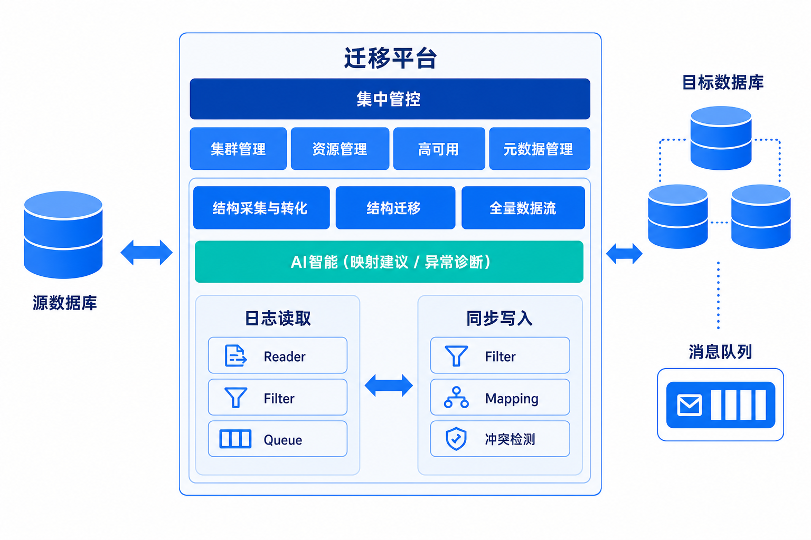
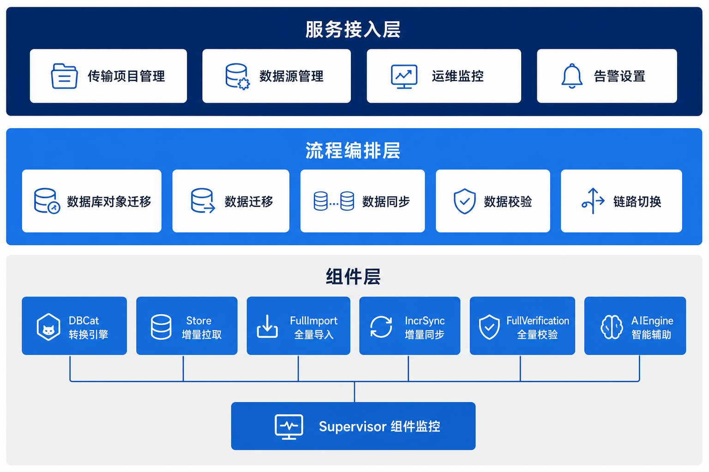
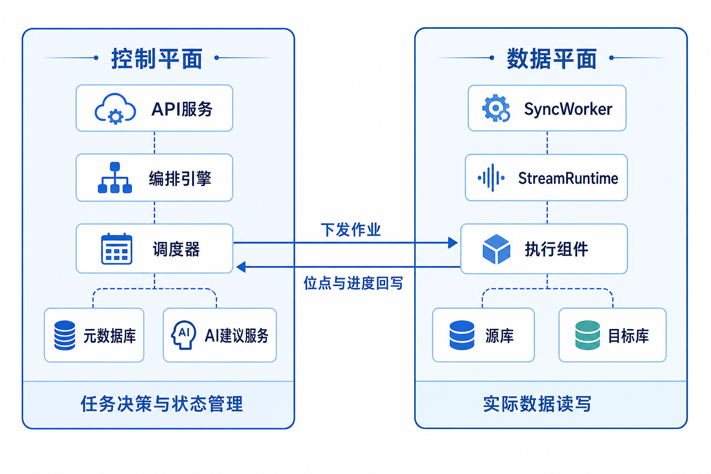
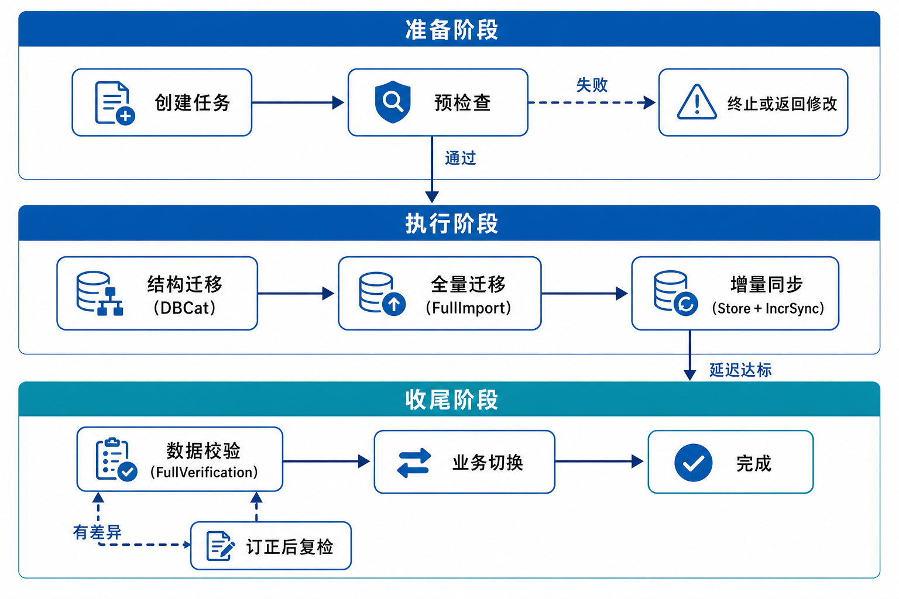
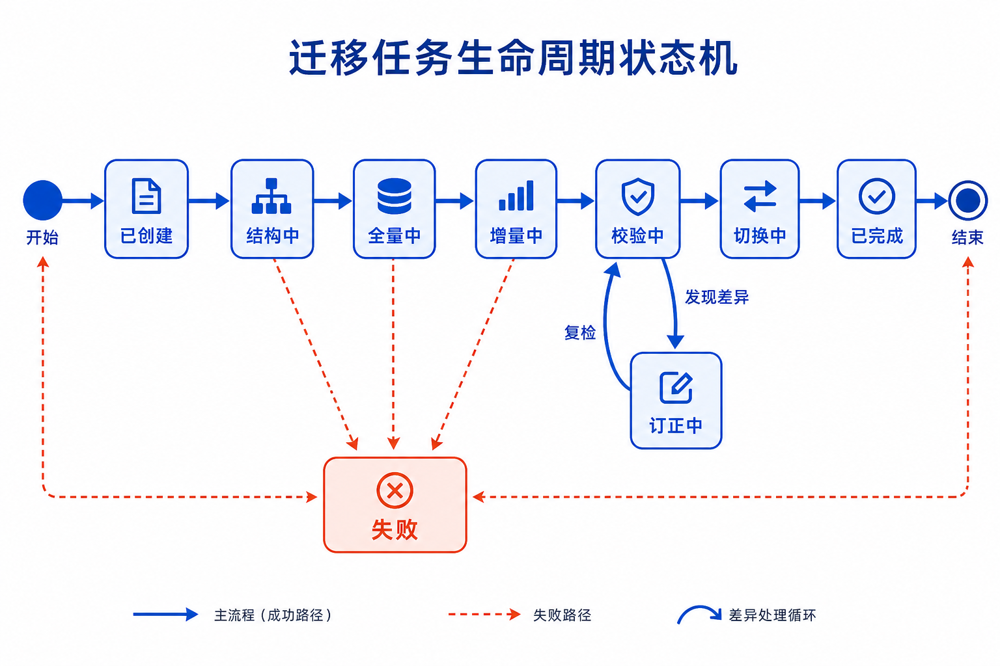
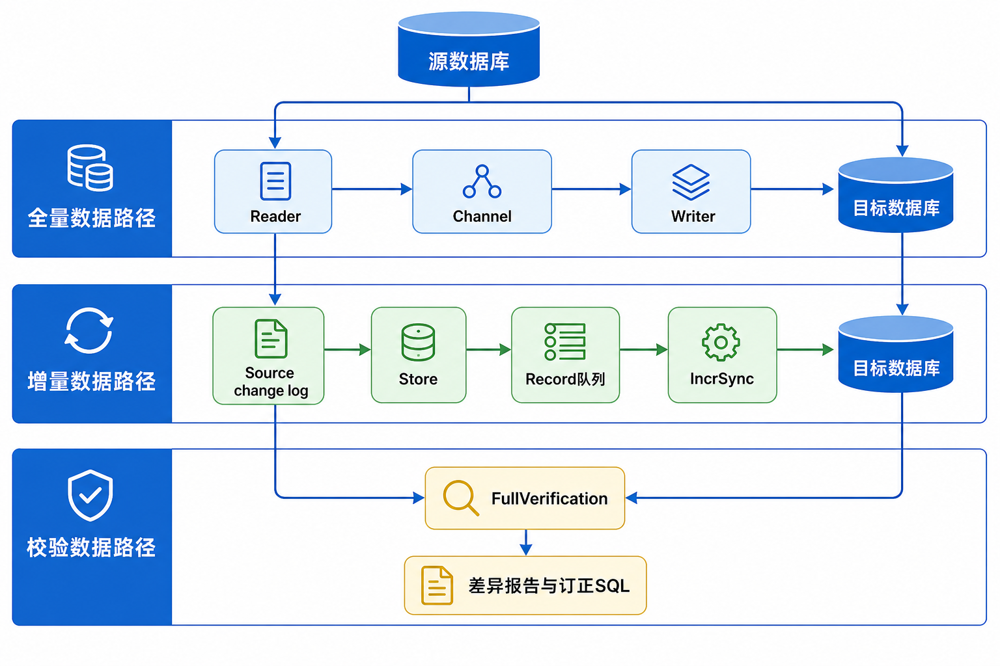
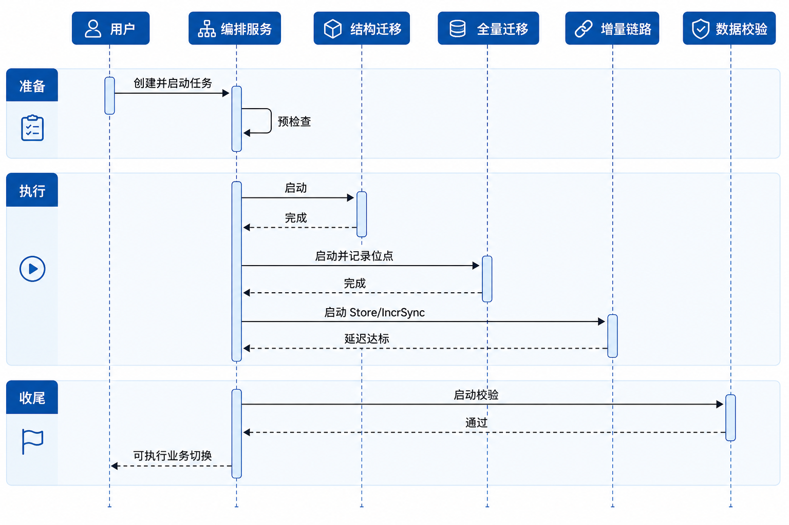

# 迁移平台软件设计说明书

| 属性 | 内容 |
|------|------|
| **文档名称** | 迁移平台软件设计说明书（SDD） |
| **文档版本** | v3.3 |
| **编制日期** | 2026-07-10 |
| **文档状态** | 评审稿 |
| **适用范围** | 异构数据迁移平台 |

---

## 修订历史

| 版本 | 日期 | 修订人 | 修订说明 | 状态 |
|------|------|--------|----------|------|
| v1.0 | 2026-07-09 | — | 初稿：完成架构、模块、流程与非功能设计 | 已归档 |
| v2.0 | 2026-07-09 | — | 修订：完善模块划分与流程衔接 | 已归档 |
| v3.0 | 2026-07-10 | — | 模块图改为分层嵌套风格；精简模块介绍 | 已归档 |
| v3.1 | 2026-07-10 | — | 优化流程/模块图可读性 | 已归档 |
| v3.2 | 2026-07-10 | — | 架构改为源-平台-目标；三层模块图；新增 AIEngine | 已归档 |
| v3.3 | 2026-07-10 | — | 全部架构图与流程图按产品级框图风格重绘 | 评审稿 |

---

## 目录

1. [引言](#1-引言)
2. [系统概述](#2-系统概述)
3. [系统架构设计](#3-系统架构设计)
4. [模块设计](#4-模块设计)
5. [流程设计](#5-流程设计)
6. [数据与接口设计](#6-数据与接口设计)
7. [调度与资源管理](#7-调度与资源管理)
8. [非功能设计](#8-非功能设计)
9. [附录](#9-附录)

---

## 1. 引言

### 1.1 编写目的

本文档是迁移平台软件设计说明书，描述系统架构、模块划分与迁移流程，供研发与评审使用。

读者对象：架构师、后端/前端开发、测试工程师、运维工程师及项目评审人员。

### 1.2 文档范围

**范围内：**

- 逻辑架构（源库 → 迁移平台 → 目标库/消息队列）与控制面/数据面分离设计
- 三层模块划分（服务接入层 / 流程编排层 / 组件层）与技术选型
- 执行组件（含 AIEngine）与 Supervisor 监控边界
- 标准迁移流程（结构 → 全量 → 增量 → 校验 → 切换）的状态机、衔接与数据流
- 核心数据模型、插件能力矩阵、调度资源与非功能设计

**范围外：**

- 详细 API 字段级规范（另立接口文档）
- 各数据库插件的实现细节与 SQL 方言差异清单
- 运维手册、安装部署步骤书

### 1.3 术语与缩略语

| 术语 | 说明 |
|------|------|
| DBCat | Schema 采集、类型映射与目标端 DDL 生成执行组件 |
| FullImport | 全量数据导入组件，负责存量数据切片、读取与写入 |
| Store | 源端增量日志拉取、解析与持久化组件 |
| IncrSync | 增量 Record 应用至目标端的组件 |
| FullVerification | 源/目标全字段对比校验组件 |
| AIEngine | 智能辅助组件：映射建议、异常诊断与差异解释 |
| Supervisor | 组件健康监控与 HA 触发代理 |
| Record | 统一数据抽象：全量为 Column 行模型，增量为 DML/DDL/HB |
| Checkpoint | 增量运行时的一致性快照，用于故障恢复与断点续传 |
| SyncWorker | 全量迁移 Worker 进程，执行 Reader-Channel-Writer 管道 |
| StreamRuntime | 增量流式运行时，管理 IncrSync 作业调度与状态 |
| Channel | Reader 与 Writer 之间的内存传输通道，支持背压与流控 |

### 1.4 参考文档

| 序号 | 文档 | 说明 |
|------|------|------|
| 1 | 本文档 | 软件设计说明书正文 |
| 2 | `doc/images/` | 架构图、模块图、流程图 |

---

## 2. 系统概述

### 2.1 背景

企业在数据库升级、云迁移与架构转型（集中式 → 分布式）过程中，普遍面临以下挑战：

- **异构数据源**：源端与目标端在类型系统、对象模型、字符集与约束语义上存在差异，结构迁移与数据写入需统一转换。
- **有限停机窗口**：业务要求迁移期间尽量不停写，停机仅发生在最终切换瞬间。
- **全量与增量衔接**：全量搬运期间源端持续产生变更，必须保证位点精确衔接，避免丢数或重复空洞。
- **多阶段运维复杂度**：结构、全量、增量、校验、切换涉及多组件协同，需要统一编排、可观测与可回退能力。

本平台面向上述挑战，建设端到端的异构数据迁移能力，覆盖从任务创建到业务切换的完整生命周期。

### 2.2 设计目标

| 目标 | 指标/说明 |
|------|-----------|
| 端到端迁移 | 结构 → 全量 → 增量 → 校验 → 切换，一站式完成 |
| 低停机 | 增量同步期间业务可继续写入源端，停机窗口压缩至切换阶段 |
| 数据一致性 | 全量位点与增量位点精确衔接，支持全字段校验与差异订正 |
| 高可用 | Store / IncrSync 支持 HA，故障自动检测与重建 |
| 可扩展 | 插件化 Reader / Writer / LogAdapter / TypeMapper，快速接入新数据源 |
| 可观测 | 任务进度、吞吐、延迟、脏数据、差异数据全程可监控可告警 |

### 2.3 设计原则

1. **分层解耦**：服务接入层、流程编排层、组件层职责清晰，各层可独立演进。
2. **插件扩展**：Reader、Writer、LogAdapter、TypeMapper 通过统一 SPI 与 `plugin.json` 注册加载，新增数据源不改动核心框架。
3. **流程驱动**：以状态机编排迁移阶段，子任务可并行、可重试、可回滚，阶段门控保证依赖正确。
4. **统一数据模型**：全量采用统一 Column 行模型；增量采用 DML / DDL / HB Record，屏蔽源端日志差异。
5. **控制面与数据面分离**：编排、调度、元数据属于控制平面；实际读写与日志消费属于数据平面，便于独立扩缩与故障隔离。
6. **智能辅助**：AIEngine 提供映射与诊断建议，默认人工确认，不替代确定性执行链路。
7. **可观测**：指标、日志、链路与告警贯穿任务全生命周期，支撑运维决策与 SLA 保障。

### 2.4 能力范围

| 能力维度 | 说明 |
|----------|------|
| 结构迁移 | DBCat 完成 Schema 采集、类型映射、DDL 生成与执行 |
| 全量迁移 | FullImport + SyncWorker 完成存量数据高吞吐搬运 |
| 增量同步 | Store 拉取解析 + IncrSync 应用，StreamRuntime 保障断点续传 |
| 数据校验 | FullVerification 全字段分片对比、差异报告与订正复检 |
| 业务切换 | 校验通过后执行连接串/DNS 切换，压缩停机窗口 |
| 运维能力 | 统一控制台、调度资源、HA、监控告警与多租户权限 |
| 智能辅助 | AIEngine 提供映射建议、异常诊断与校验差异解释 |

---

## 3. 系统架构设计

### 3.1 设计目标与约束

架构设计以「端到端可编排、执行可扩展、运行可观测、智能可辅助」为目标：左侧对接源库，中间为迁移平台，右侧输出到目标库或消息队列。控制平面负责任务意图与状态，数据平面负责吞吐与延迟；元数据为权威状态源；增量链路必须支持位点衔接与组件级高可用；AI 仅作辅助决策，不替代核心执行链路。

### 3.2 总体逻辑架构

平台采用 **源库 → 迁移平台 → 目标库/消息队列** 的端到端结构。平台内部自上而下划分为：集中管控、基础服务、结构与全量、增量日志管道，以及 AI 智能辅助。



**图 3-1 系统逻辑架构图**

**集中管控**提供控制台、OpenAPI 与认证鉴权，是用户与运维的统一入口，负责任务创建、进度查看与告警处置，不直接搬运业务数据。

**基础服务**包括集群管理、资源管理、高可用与元数据管理，为迁移组件提供注册、配额、选主与配置/位点持久化能力。

**结构与全量**覆盖结构采集与转化、结构迁移以及全量数据流：先完成 Schema 落地，再按切片并发搬运存量数据，并在全量启动时记录增量起始位点。

**增量管道**分为日志读取与同步写入两侧：读取侧完成 Reader → Filter → Queue；写入侧完成 Filter → Mapping → 冲突检测，两侧通过队列解耦，保障变更持续追平。

**AI 智能**为结构映射与运维诊断提供建议（类型映射/DDL 改写、失败归因、差异解释），结果供 DBCat、编排或人工确认，不阻断主链路。

**数据出口**：迁移结果写入目标数据库；也可将变更投递至消息队列，供下游消费。

### 3.3 模块划分

模块按 **服务接入层 → 流程编排层 → 组件层** 三层组织，组件层由 Supervisor 统一监控。



**图 3-2 模块组成图**

**服务接入层**：传输项目管理、数据源管理、运维监控、告警设置。面向用户与运维，完成项目配置、连接管理与可观测入口。

**流程编排层**：数据库对象迁移、数据迁移、数据同步、数据校验、链路切换。以状态机驱动端到端阶段，负责任务门控、并行策略与失败重试，不直接读写业务数据。

**组件层**：DBCat（转换引擎）、Store（增量拉取）、FullImport（全量导入）、IncrSync（增量同步）、FullVerification（全量校验）、AIEngine（智能辅助）。各组件由编排层按阶段调度，由 **Supervisor** 统一监控健康并触发 HA。

主链路：接入层创建项目 → 编排层推进阶段 → 组件层执行 → Supervisor 守护；AIEngine 在结构映射与异常/差异分析时被编排或组件调用。

### 3.4 控制平面与数据平面



**图 3-3 控制平面与数据平面分离图**

**控制平面**包含接入层、编排层、调度器、元数据、认证鉴权与 AI 建议服务，负责任务意图、阶段推进、资源配置与状态持久化，不承载大流量数据拷贝。

**数据平面**包含 FullImport / Store / IncrSync / FullVerification 等执行进程以及源/目标库与日志队列，负责实际读写、解析与 Record 应用，按吞吐与延迟目标独立扩缩。

**边界与交互**：控制平面下发作业规格与启停指令；数据平面回写位点与进度；Supervisor / HA 在数据平面异常时由控制平面决策重建。AIEngine 读取元数据与监控摘要，输出建议报告，不直接写入业务库。

### 3.5 技术选型

| 模块 | 建议技术 | 说明 |
|------|----------|------|
| 后端服务 | Java 17 + Spring Boot 3 | 与插件 SPI、Worker 运行时技术栈一致 |
| 全量执行 | SyncWorker + Reader/Writer 插件 | 平台内全量管道运行时 |
| 增量执行 | StreamRuntime + LogAdapter 插件 | 平台内增量流式运行时与 Checkpoint |
| AI 推理 | 本地或远程 LLM API | 映射建议、日志诊断与差异解释 |
| 前端控制台 | React | 任务管理、进度大盘与运维操作 |
| API 网关 | Spring Cloud Gateway | 鉴权、限流、路由与审计 |
| 元数据库 | MySQL 8 / PostgreSQL | 任务配置、位点、映射与组件注册 |
| 时序监控 | Prometheus | 指标存储与查询 |
| 协调服务 | ZooKeeper / etcd | HA 选主、组件注册 |

---

## 4. 模块设计

本章按 **Migration Core、接入与编排、执行能力（含 AIEngine）、横切能力、运行时与插件** 分区介绍。各模块仅描述职责、能力要点与对外接口。

### 4.0 Migration Core（核心层）

Migration Core 是执行框架的公共底座，为全量管道与增量流式处理提供统一抽象：

- **Record 模型**：全量使用 Column 行 Record；增量使用 DML / DDL / HB，屏蔽源端差异。
- **Channel**：Reader 与 Writer 之间的内存通道，支持字节容量背压与流控。
- **插件容器**：按 `plugin.json` 注册，ClassLoader 隔离加载 Reader / Writer / LogAdapter / TypeMapper。
- **配置中心**：作业规格、限速、并发、Checkpoint 等运行参数的统一下发与校验。
- **通信统计**：汇聚 byteSpeed、recordSpeed、脏数据计数等，供监控与编排消费。

---

### 4.1 接入与编排

#### 4.1.1 控制台 UI

**职责**

Web 管理控制台，提供迁移任务全生命周期可视化管理，是平台主要人机交互入口。

**能力要点**

- 任务向导：创建项目、配置源/目标、选择对象与同步策略
- 进度大盘：阶段状态、吞吐、延迟、表/行进度
- 日志与告警：子任务日志检索、告警规则与通知渠道
- 系统管理：资源配额、HA 参数、插件目录浏览
- RBAC 菜单权限与 WebSocket/SSE 状态推送

**对外接口**

- 输入：用户操作、查询筛选、告警与系统配置
- 输出：经 API 网关的 REST 请求；页面渲染状态/指标/报告
- 依赖：API 网关

#### 4.1.2 API 网关

**职责**

平台统一北向入口，对外暴露 RESTful OpenAPI，对内路由至编排、元数据等服务。

**能力要点**

- 路径路由、多版本共存（`/api/v1` 等）
- Token 鉴权与租户/用户上下文注入
- 按租户/API 限流熔断与写操作审计
- 幂等键支持任务创建等防重写操作
- CLI/SDK 与控制台共用同一套 API

**对外接口**

- 输入：控制台、CLI/SDK、外部系统的 HTTP(S) 请求
- 输出：内部服务调用；统一 JSON 响应
- 依赖：认证鉴权、任务编排、元数据服务

#### 4.1.3 认证鉴权

**职责**

提供身份认证、RBAC 授权、多租户隔离与操作审计，保障多租户安全合规。

**能力要点**

- 用户名密码、LDAP/SSO 集成
- 角色-权限-资源模型与租户配额隔离
- 数据源凭证加密存储与按需解密
- 敏感操作二次确认与审计异步落库
- 网关 fail-close：鉴权超时默认拒绝

**对外接口**

- 输入：登录凭证、权限校验请求、审计事件
- 输出：Access Token、权限判定、审计记录
- 依赖：元数据库、密钥管理（KMS）

#### 4.1.4 任务编排服务

**职责**

迁移任务全生命周期管理的核心域服务，维护 MigrationProject / MigrationTask 及用户可见状态。

**能力要点**

- 任务 CRUD 与启动/暂停/恢复/终止/重试
- 预检查：连通性、权限、版本兼容性
- 阶段门控：前序子任务成功后才进入下一阶段
- 进度统计聚合，供控制台展示
- 乐观锁防并发冲突，领域事件驱动监控/审计

**对外接口**

- 输入：API 任务操作、工作流回调、Supervisor 告警
- 输出：工作流启动指令、调度请求、状态变更事件
- 依赖：工作流、元数据、数据源注册中心、调度器

#### 4.1.5 工作流服务

**职责**

子任务流水线编排引擎，以状态机驱动结构、全量、增量、校验、切换的依赖与并行策略。

**能力要点**

- SubTask 状态迁移（Pending / Running / Success / Failed）
- 阶段前置条件与 DAG 依赖解析
- 全量/校验表级并行，增量单链路
- 失败重试、人工介入、Repairing 订正回路
- 先申请资源再启动组件

**对外接口**

- 输入：编排阶段推进指令、执行组件完成回调
- 输出：组件启动命令、SubTask 状态、阶段完成事件
- 依赖：各执行组件、调度器、元数据服务

#### 4.1.6 元数据服务

**职责**

平台配置与运行状态的权威持久化服务，管理任务配置、位点、映射、统计与组件注册。

**能力要点**

- 任务/同步参数与限速配置持久化
- 全量 `startPosition`、Store 位点、Checkpoint 引用管理
- Schema 映射版本号与 DDL 记录
- 组件实例注册与运行统计
- 位点双写（本地缓存 + 元库）防脑裂

**对外接口**

- 输入：各服务读写请求、组件心跳与位点上报
- 输出：配置、位点快照、映射记录
- 依赖：元数据库（MySQL / PostgreSQL）

#### 4.1.7 数据源注册中心

**职责**

统一管理源端与目标端连接信息，提供连通性检测、连接池与凭证安全存储。

**能力要点**

- 数据源 CRUD、测试连接、类型/版本识别
- 按数据源维护可复用连接池与探活
- 凭证加密、租户命名空间隔离
- 被任务引用时禁止删除（引用计数）
- SSL/TLS 证书集中配置

**对外接口**

- 输入：连接串、凭证、JDBC 扩展参数
- 输出：数据源 ID、测试结果、受控连接获取接口
- 依赖：认证鉴权、元数据库；被 DBCat / FullImport / Store / FullVerification 调用

---

### 4.2 执行能力

#### 4.2.1 DBCat

**职责**

结构迁移执行组件，负责源端 Schema 采集、异构类型映射、目标端 DDL 生成与执行。

**能力要点**

- 采集表、索引、约束、视图、序列等对象
- 按源端方言解析并调用 TypeMapper 完成类型转换
- 按依赖拓扑序生成并执行目标端 DDL
- 映射结果写入元数据，支持规则覆盖
- 不支持对象可降级/跳过并告警，或导出 SQL 人工修订

**对外接口**

- 输入：任务 ID、源/目标数据源、对象清单、映射规则
- 输出：执行日志、映射元数据、SubTask 完成状态
- 依赖：工作流、数据源注册中心、元数据服务、TypeMapper 插件

#### 4.2.2 FullImport

**职责**

全量数据迁移执行组件，将源端存量数据高吞吐迁移至目标端。

**能力要点**

- 根据映射元数据生成全量作业配置
- 按主键/分区表级切片，Task 严格 1:1 Reader-Channel-Writer
- Channel 背压流控、令牌桶限速与脏数据 errorLimit
- 全量启动时记录 `startPosition` 供增量衔接
- Task 级 Failover 可配置重试

**对外接口**

- 输入：任务配置、表清单、并发度、限速参数
- 输出：吞吐统计、`startPosition`、SubTask 状态
- 依赖：工作流、调度器、SyncWorker、Reader/Writer 插件、元数据与数据源服务

#### 4.2.3 Store

**职责**

增量日志拉取组件，从源端变更日志读取、解析为统一 Record 并持久化。

**能力要点**

- 通过 LogAdapter 拉取并解析源端变更日志
- 输出统一 DML / DDL / HB Record 流
- 从全量 `startPosition` 起拉，保证不丢变更
- 维护生产/消费位点并上报元数据
- 支持 HA：异常时在健康节点重建

**对外接口**

- 输入：数据源连接、`startPosition`、订阅表清单
- 输出：Record 流、位点、组件心跳
- 依赖：工作流、元数据、数据源注册中心、LogAdapter；协作 Supervisor / HA

#### 4.2.4 IncrSync

**职责**

增量同步执行组件，将 Store 产生的 Record 应用至目标端，由 StreamRuntime 调度运行。

**能力要点**

- 消费 DML / DDL / HB，完成映射转换与目标写入
- 有主键表幂等写入；DDL 与 DML 分流处理
- Checkpoint 周期性一致性快照，支持断点续传
- 基于 HB 与位点差计算并上报同步延迟
- 支持 HA：进程重启或跨节点重建（含冷却期）

**对外接口**

- 输入：Record 流、映射配置、目标数据源
- 输出：应用结果、Checkpoint 位点、延迟指标
- 依赖：Store、StreamRuntime、元数据；协作 Supervisor / HA

#### 4.2.5 FullVerification

**职责**

数据校验组件，对源端与目标端进行全字段、分片并行对比，输出差异报告与订正 SQL。

**能力要点**

- 增量延迟低于阈值后触发，降低假差异
- 按主键/索引分片并行、流式读取
- 统一类型格式化后逐行对比
- 输出差异报告与订正 SQL
- 支持 Repairing → Verifying 多轮复检

**对外接口**

- 输入：校验表清单、分片大小、延迟阈值
- 输出：差异报告、订正 SQL、SubTask 状态
- 依赖：工作流、元数据、数据源注册中心、源/目标库；可选调用 AIEngine 解释差异

#### 4.2.6 AIEngine

**职责**

智能辅助组件，为结构转换与运维决策提供建议，不替代 DBCat / FullImport / Store / IncrSync / FullVerification 等核心执行链路。

**能力要点**

- 基于源/目标元数据给出类型映射与 DDL 改写建议，供 DBCat 确认或人工修订
- 分析任务失败日志、延迟与脏数据特征，输出诊断结论与调参建议
- 对校验差异做归类解释（类型精度、字符集、时钟偏差等）
- 建议结果可审计、可忽略，默认不自动改写生产配置
- 由 Supervisor 监控服务健康与调用超时

**对外接口**

- 输入：映射上下文、运行指标摘要、日志片段、差异样本
- 输出：建议报告（映射方案 / 诊断结论 / 差异解释）
- 依赖：元数据服务、监控告警；被编排层、DBCat、FullVerification 调用

---

### 4.3 横切能力

#### 4.3.1 调度器

**职责**

接收编排/工作流下发的作业调度请求，结合资源池状态将作业分配到合适 Worker 节点。

**能力要点**

- 全量/增量多队列与优先级排队
- 按作业需求匹配 SyncWorker / StreamWorker Slot
- 亲和调度：Store 近源、IncrSync 近目标
- 队列深度驱动弹性扩缩容
- 节点失效时失败重调度；调度器自身主备选主

**对外接口**

- 输入：工作流调度请求、资源池状态
- 输出：Worker 作业分配、StreamRuntime 作业句柄
- 依赖：资源池、SyncWorker、StreamRuntime、元数据服务

#### 4.3.2 资源池

**职责**

统一管理 SyncWorker 与 StreamWorker 等计算资源，提供配额、隔离与弹性能力。

**能力要点**

- Worker 节点上线/下线登记与使用率上报
- 租户/项目级 CPU、内存、并发作业配额
- 资源隔离与超卖保护（预留系统缓冲）
- 对接 Kubernetes 弹性伸缩
- 节点失联标记不可用并触发作业迁移

**对外接口**

- 输入：节点注册、心跳、配额配置
- 输出：可用资源快照、分配/释放确认
- 依赖：元数据服务、监控告警；被调度器消费

#### 4.3.3 HA 组件

**职责**

高可用决策与执行模块，在 Store / IncrSync 异常或节点宕机时触发重建、切换与注册更新。

**能力要点**

- 基于心跳超时判定宕机，与 Supervisor 形成「检测 → 决策 → 执行」闭环
- Store HA：健康节点重建并按策略回退位点
- IncrSync HA：重启或跨机重建，冷却期防抖
- 维护组件注册表，删除故障实例
- 可配置 enable 开关与操作间隔，防止抖动

**对外接口**

- 输入：Supervisor 告警、组件注册表、HA 配置
- 输出：重建指令、注册变更、HA 审计
- 依赖：元数据、协调服务（etcd/ZK）、调度器

#### 4.3.4 监控告警

**职责**

采集、存储、可视化全链路指标，并按规则触发告警通知。

**能力要点**

- 采集吞吐、延迟、进度、脏数据、资源与组件健康
- 写入时序库，控制台/Grafana 可视化
- 任务失败、延迟过高、脏数据超限、校验差异、组件异常等规则
- 多渠道通知与告警抑制/静默
- 时序库不可用时本地缓冲补写

**对外接口**

- 输入：各组件指标推送、心跳事件
- 输出：告警事件、大盘数据、Webhook 通知
- 依赖：时序库、AlertManager、控制台；协作编排服务

#### 4.3.5 Supervisor

**职责**

组件健康监控代理，定时心跳上报，检测 Store / IncrSync / AIEngine 等异常并触发 HA 或告警。

**能力要点**

- 汇报节点与组件存活
- 检测进程/端口健康，超时判定异常
- 将「检测」与「恢复」分离：发现后通知 HA 组件
- 采集本地基础指标
- 可配置心跳间隔与宕机判定阈值

**对外接口**

- 输入：本地组件状态、HA 配置参数
- 输出：心跳记录、HA 触发事件、监控指标
- 依赖：元数据、HA 组件、监控告警
- 监控对象：DBCat、Store、FullImport、IncrSync、FullVerification、AIEngine

---

### 4.4 运行时与插件

#### 4.4.1 SyncWorker

**职责**

全量迁移 Worker 运行时，在 Worker 进程内执行 FullImport 作业的 Reader-Channel-Writer 管道。

**能力要点**

- JobContainer 解析作业配置并切分 Task / TaskGroup
- MemoryChannel 并发控制与背压
- Writer 先于 Reader 启动，避免通道残留
- 令牌桶限速与 Communication 统计上报
- Task Failover 与进程崩溃后由调度器重提

**对外接口**

- 输入：作业配置、插件 JAR、资源配额
- 输出：运行统计、完成/失败回调、脏数据报告
- 依赖：调度器、FullImport、Reader/Writer 插件、资源池

#### 4.4.2 StreamRuntime

**职责**

增量流式运行时，调度 IncrSync 作业并管理 Checkpoint / Savepoint。

**能力要点**

- StreamCoordinator 协调作业与 Checkpoint 触发
- StreamWorker + Slot 执行 IncrSync Task
- 周期性分布式快照与手动 Savepoint
- 并行度与 Slot 匹配，事件单线程处理降低锁竞争
- Coordinator 选主 HA；连续 Checkpoint 失败则暂停告警

**对外接口**

- 输入：执行图、并行度、Checkpoint 配置
- 输出：作业状态、Checkpoint 元数据、指标
- 依赖：调度器、IncrSync、资源池、元数据服务

#### 4.4.3 Reader/Writer 插件

**职责**

为 FullImport 提供异构数据源读取与写入能力的插件体系。

**能力要点**

- Reader.Job/Task 与 Writer.Job/Task 对称 SPI
- `plugin.json` 注册，ClassLoader 隔离加载
- 严格 1:1 Reader-Writer Task 配对
- 可选 Transformer：脱敏、过滤、字段转换
- 启动前插件存在性与兼容性校验

**对外接口**

- 输入：Task 配置、数据源连接
- 输出：Column 行 Record 流（Reader）或写入确认（Writer）
- 依赖：FullImport、SyncWorker、数据源注册中心、插件注册中心

#### 4.4.4 LogAdapter 插件

**职责**

源端变更日志适配器，为 Store 提供各类数据库日志的拉取、分片与位点提交能力。

**能力要点**

- LogReader 订阅变更并输出统一 Record
- SplitEnumerator 管理库表/分区等日志分片
- OffsetCommitter 与 StreamRuntime Checkpoint 对齐
- 处理源端 DDL 事件与事务边界
- SPI 注册与启动前版本兼容校验

**对外接口**

- 输入：适配器配置、起始位点、表过滤规则
- 输出：DML/DDL/HB Record 流、Enumerator Checkpoint
- 依赖：Store、IncrSync、数据源注册中心、元数据（Schema）

---

## 5. 流程设计

### 5.1 迁移业务流程概述



**图 5-1 标准迁移流程图**

流程按 **准备 → 执行 → 收尾** 三段推进，各阶段说明如下：

**准备阶段**

1. **创建任务**：注册源/目标数据源，选择迁移对象与策略，生成 MigrationTask。
2. **预检查**：验证网络连通、账号权限、版本兼容与对象可迁移性；失败则终止或返回修改。

**执行阶段**

3. **结构迁移（DBCat）**：完成 Schema 转换并在目标端落地对象，写入映射版本；可选调用 AIEngine 生成映射建议。
4. **全量迁移（FullImport）**：搬运存量数据，启动时记录增量起始位点。
5. **增量同步（Store + IncrSync）**：自位点拉取变更并持续追平目标端。

**收尾阶段**

6. **数据校验（FullVerification）**：延迟达标后对比源/目标；有差异则订正后复检，可选由 AIEngine 解释差异原因。
7. **业务切换**：校验通过后切换连接，压缩停机窗口。
8. **完成**：任务归档。

### 5.2 流程设计说明

迁移阶段顺序由数据依赖、一致性约束与停机最小化共同决定，不可随意调换。

**结构迁移必须先行。** 目标端需要先具备与源端语义对齐的表、索引与约束，全量 Writer 与增量应用才有承载对象。若跳过结构直接写数，将出现建表失败、类型不兼容或约束冲突。结构阶段还将映射结果版本化写入元数据，供后续阶段按统一对象名与类型语义执行。复杂异构映射可先由 AIEngine 给出建议，经确认后再由 DBCat 执行。

**全量迁移建立存量基线。** 在增量启动前，必须将历史数据搬至目标端。若仅做增量不同步全量，目标端缺少基线，无法还原完整数据集。全量启动瞬间记录源端日志位点 `startPosition`，为后续增量覆盖「全量期间并发写入」提供锚点。

**增量同步补齐运行期变更。** 全量执行期间源端业务持续写入，全量结束至切换前的变更必须由增量链路追平。Store 从 `startPosition` 拉取，IncrSync 幂等应用至目标端；Checkpoint 保障故障后可续传。增量将停机需求从「全量窗口」推迟到「切换瞬间」。

**数据校验独立验真。** 结构、全量、增量完成后，需在切换前用 FullVerification 验证一致性。校验启动前要求增量延迟低于阈值，避免追平过程中的假差异。发现差异进入订正与复检回路，未通过则阻塞切换；AIEngine 可对差异样本做归类解释，辅助人工订正。

**业务切换是最后一步。** 仅当校验通过（差异为 0 或已订正复检通过）才执行 DNS/连接串切换并停止源端写入。提前切换会导致双写与一致性风险；延后切换则拉长并行运行成本。切换将停机窗口压缩到可预期的短暂操作。

概括而言：**先有可写容器（结构），再有存量基线（全量），再补运行期变更（增量），再独立验真（校验），最后切流量（切换）。**

### 5.3 任务状态机



**图 5-2 迁移任务状态机**

任务层次模型：

```text
MigrationProject（迁移项目）
  └── MigrationTask（迁移任务，一对源→目标）
        ├── SubTask: SchemaMigration（结构迁移）
        ├── SubTask: FullMigration（全量迁移，可按表并行）
        ├── SubTask: IncrementalSync（增量同步，单链路）
        ├── SubTask: Verification（数据校验，可按表并行）
        └── SubTask: Switchover（业务切换）
```

**主路径**：`已创建 → 结构中 → 全量中 → 增量中 → 校验中 → 切换中 → 已完成`。

**异常路径**：结构/全量/增量阶段不可恢复失败进入 `失败`；支持按子任务重试或人工介入后恢复。编排层以元数据库状态为准。

**复检路径**：校验发现差异进入 `订正中`，完成后回到 `校验中`；多轮复检通过后方可切换。

### 5.4 阶段衔接设计

阶段之间通过明确的门控条件与共享元数据衔接，避免「状态已前进、数据未就绪」。

| 阶段转换 | 衔接要点 | 责任模块 |
|----------|----------|----------|
| 预检查 → 结构 | 权限、网络、版本检查全部通过 | 任务编排服务 |
| 结构 → 全量 | 结构完成并锁定映射；写入 **mapping version**；全量按映射后对象读写 | DBCat → FullImport |
| 全量 → 增量 | 全量**开始时**记录 **startPosition**；结束后 Store 从该位点拉取 | FullImport → Store → IncrSync |
| 增量 → 校验 | 增量延迟低于配置的 **delay threshold** | IncrSync → FullVerification |
| 校验 → 切换 | 差异为 0 或订正复检通过 | FullVerification → 编排服务 |
| 切换 → 完成 | 停止源端写入（可选）；任务归档 | 任务编排服务 |

**startPosition**：全量启动瞬间采集的源端日志位点。全量期间源端变更由日志保留；全量结束后 Store 自该位点消费，覆盖并发写入，避免空洞。

**mapping version**：结构迁移完成后递增的映射版本号。全量、增量、校验均绑定同一版本，防止结构变更后读写语义漂移；若需调整映射，应生成新版本并评估是否重跑受影响阶段。

**delay threshold**：允许进入校验的最大增量延迟。阈值过低会频繁阻塞校验，过高则增加假差异；建议按业务 RPO 与表规模调参，并在大表场景适当放宽后配合复检。

### 5.5 并行与串行策略

| 阶段 | 策略 | 说明 |
|------|------|------|
| 结构迁移 | 串行（对象依赖拓扑序） | 外键、索引等依赖要求 DDL 按序执行 |
| 全量迁移 | 表级并行 | 表间无强一致依赖，可水平扩展吞吐 |
| 增量同步 | 单链路 | 保持全局位点顺序语义；分片在运行时内部管理 |
| 数据校验 | 表级并行 | 各表独立对比，可水平扩展 |
| 业务切换 | 串行 | 全局原子操作，避免部分应用已切、部分仍写源端 |

```text
结构迁移（串行）→ 全量迁移（表级并行）→ 增量同步（单链路）→ 数据校验（表级并行）→ 业务切换（串行）
```

工作流按策略拆分 SubTask：全量/校验为每表生成可并行子任务；增量仅创建一个 IncrSync 子任务。

### 5.6 核心数据流



**图 5-3 核心数据流图**

图中分三条路径，便于对照阅读：

| 路径 | 走向 | 说明 |
|------|------|------|
| 全量 | 源库 → Reader → Channel → Writer → 目标库 | SyncWorker 内 1:1 管道搬运存量 |
| 增量 | 源库变更日志 → Store → Record 队列 → IncrSync → 目标库 | 自全量位点持续追平 |
| 校验 | 源库 + 目标库 → FullVerification → 差异报告 | 延迟达标后独立验真 |

#### 5.6.1 结构迁移数据流

源端 Schema 采集 → 方言语法解析 → TypeMapper 类型映射 → 目标端 DDL 按拓扑序执行 → 映射元数据与 mapping version 写入元数据服务。

#### 5.6.2 全量迁移数据流

编排层生成作业规格 → SyncWorker 切分 Task → Reader 读源端 → Channel 传输（背压/限速）→ Writer 写目标端；启动时落盘 `startPosition`。

#### 5.6.3 增量同步数据流

变更日志经 LogAdapter 由 Store 拉取解析为 DML/DDL/HB → 进入 Record 队列 → IncrSync 应用至目标库；StreamRuntime Checkpoint 持久化消费位点。

#### 5.6.4 数据校验数据流

按主键/索引切片 → 源/目标流式读取 → 类型格式化对比 → 输出差异报告与订正 SQL → 可选进入订正复检循环。

### 5.7 端到端时序



**图 5-4 端到端迁移时序图**

时序按准备 / 执行 / 收尾三段组织，参与者精简为：用户、编排服务、结构迁移、全量迁移、增量链路、数据校验。

1. **准备**：用户创建并启动任务；编排完成预检查。
2. **执行**：编排依次调度结构迁移 → 全量迁移（记录位点）→ 增量链路（Store + IncrSync）；增量延迟达标后进入收尾。
3. **收尾**：启动校验；通过后通知用户可执行业务切换。

异常时失败回调编排进入失败或订正复检；HA 场景下 Supervisor 检测增量链路异常并由 HA 重建，位点可恢复时无需重跑全量。

---

## 6. 数据与接口设计

### 6.1 核心数据模型

| 实体 | 主要字段 | 说明 |
|------|----------|------|
| MigrationProject | id, name, tenant_id, created_at | 迁移项目 |
| MigrationTask | id, project_id, source_ds_id, target_ds_id, status | 一对源→目标任务 |
| SubTask | id, task_id, type, status, progress | 子任务（Schema/Full/Incr/Verify/Switch） |
| DataSource | id, type, connection, encrypted_credential | 数据源 |
| SchemaMapping | task_id, source_object, target_object, ddl, mapping_version | 结构映射 |
| Position | task_id, component, position_json, updated_at | 位点（含 startPosition、Store、Checkpoint） |
| ComponentRegistry | task_id, component_type, host, port, status | 组件注册 |
| Record（全量） | columns[] | Column 行模型 |
| Record（增量） | type(DML/DDL/HB), payload, position | 统一增量事件 |
| Position（运行时） | journal/offset 或等价日志坐标 | 源端日志位点抽象 |

### 6.2 插件能力矩阵

| 数据源 | Reader | Writer | LogAdapter | TypeMapper |
|--------|--------|--------|------------|------------|
| MySQL | ✅ | ✅ | ✅ | ✅ |
| Oracle | ✅ | ✅ | ✅ | ✅ |
| PostgreSQL | ✅ | ✅ | ✅ | ✅ |
| SQL Server | ✅ | ✅ | 🔲 | ✅ |
| MongoDB | ✅ | ✅ | 🔲 | 🔲 |
| HBase | ✅ | ✅ | — | — |
| HDFS/Hive | ✅ | ✅ | — | — |

> ✅ 已支持 / 🔲 规划中 / — 不适用

### 6.3 插件注册机制

```text
plugin/reader/mysqlreader/
  ├── plugin.json
  ├── plugin_job_template.json
  └── mysqlreader-0.0.1-SNAPSHOT.jar
```

流程：插件包提交 → 注册中心登记 → 兼容性校验 → 写入插件目录 → 运行时 ClassLoader 隔离加载 → 执行引擎按名称引用。LogAdapter 另通过 SPI 描述文件注册 Factory。

### 6.4 对外接口概要

| 接口域 | 方法示例 | 说明 |
|--------|----------|------|
| 任务管理 | `POST /api/v1/migrations` | 创建迁移任务 |
| 任务控制 | `POST /api/v1/migrations/{id}/start` | 启动/暂停/恢复/终止 |
| 数据源 | `POST /api/v1/datasources/test` | 注册与连通性测试 |
| 进度查询 | `GET /api/v1/migrations/{id}/progress` | 阶段进度与指标 |
| 校验报告 | `GET /api/v1/migrations/{id}/verification/report` | 差异报告下载 |
| 插件目录 | `GET /api/v1/plugins` | 已注册插件列表 |

详细请求/响应 Schema 另见《迁移平台 API 接口规范》。

### 6.5 内部接口原则

- 执行组件与编排层通过 gRPC/HTTP 回调上报状态与进度
- 位点上报采用异步批量，降低元数据库压力
- 所有内部调用携带 `X-Request-Id` 与租户上下文
- 控制面接口强调幂等与乐观锁；数据面接口强调背压与可重试

---

## 7. 调度与资源管理

### 7.1 调度架构

调度链路为：编排服务 / 工作流 → 调度器 → 资源池 → Worker 节点池（SyncWorker / StreamWorker）。调度器是控制平面与数据平面的衔接枢纽：上游接收作业规格，下游落实到具体进程与 Slot，并向元数据回写作业生命周期状态。

### 7.2 调度策略

| 策略 | 适用场景 |
|------|----------|
| 公平调度 | 多租户按配额分配，避免饿死 |
| 优先级调度 | 紧急迁移任务优先获得资源 |
| 亲和调度 | Store 靠近源端，IncrSync 靠近目标端 |
| 弹性调度 | 队列深度驱动 Worker 扩缩容 |

### 7.3 资源与作业映射

| 作业类型 | 资源占用 | 调度产物 |
|----------|----------|----------|
| 全量 | 1 SyncWorker / Job | JVM 进程 + Channel 并发 |
| 增量 | N StreamWorker Slot / Job | StreamRuntime 执行图 |
| 结构/校验 | 轻量 Worker 或内嵌执行 | 线程池 |

SyncWorker 以进程/容器为分配单位；StreamWorker Slot 为增量并行度隔离单元。租户配额同时约束两类资源，防止单一任务占满集群。

---

## 8. 非功能设计

### 8.1 容错

| 层级 | 机制 | 说明 |
|------|------|------|
| Task 级 | Failover 重试（maxRetryTimes） | 全量单 Task 失败自动重试 |
| 作业级 | Checkpoint + Savepoint | 增量作业断点续传与手动恢复点 |
| 组件级 | Store / IncrSync HA | Supervisor 检测 + HA 重建/切换 |
| 数据级 | 脏数据 errorLimit + 差异订正 | 超限中止；校验差异可订正复检 |

### 8.2 安全

- 传输层 TLS 加密
- 数据源凭证加密存储，执行侧最小权限账号
- RBAC + 多租户隔离 + 操作审计
- 敏感操作（删除任务、业务切换）二次确认或更高权限
- 鉴权失败默认拒绝（fail-close）

### 8.3 性能

- 全量：表级并行 + Channel 并发 + 限速可配，避免压垮源/目标
- 增量：并行度与 Slot 匹配；Store 与 IncrSync 部署亲和降低链路延迟
- 元数据：位点与统计异步批量刷盘
- 大表校验：分片流式对比，避免内存爆炸

### 8.4 可观测性

| 类别 | 代表指标 |
|------|----------|
| 吞吐 | byteSpeed、recordSpeed |
| 延迟 | 增量同步延迟（秒） |
| 进度 | 已完成表数/行数 |
| 质量 | 脏数据数、差异行数 |
| 健康 | 组件状态、心跳 |

告警覆盖任务失败、延迟过高、脏数据超限、校验差异、组件异常等，支持分级、抑制与多渠道通知。

### 8.5 兼容性

- 插件 SPI 版本化，启动前做兼容性校验
- API 多版本共存（`/api/v1`、`/api/v2`）
- 映射规则支持按源→目标组合扩展 TypeMapper
- 元数据 schema 演进需向后兼容，避免升级中断在途任务

---

## 9. 附录

### 9.1 关键设计决策

| 决策项 | 选择 | 理由 |
|--------|------|------|
| 架构分层 | 接入 / 编排 / 组件三层 + 源-平台-目标 | 职责清晰，端到端数据路径直观 |
| 控制面/数据面 | 分离 | 编排升级与 Worker 扩容互不影响，故障域隔离 |
| 全量管道 | SyncWorker + Channel | 统一背压、限速与脏数据治理，插件化扩展源/目标 |
| 增量运行时 | StreamRuntime + Checkpoint | 满足低延迟追平与断点续传 |
| Record 模型 | 全量 Column + 增量 DML/DDL/HB | 屏蔽源端差异，简化 IncrSync 与校验 |
| 位点衔接 | 全量启动记 startPosition | 覆盖全量期间并发写入，避免丢数 |
| HA 范围 | Store / IncrSync 优先 | 长驻增量链路对可用性要求最高 |
| AI 定位 | 辅助建议，不替代执行 | 降低异构映射与排障成本，保持主链路确定性 |
| 目标端策略 | 开放多数据库 / 可投递消息队列 | 通用迁移与下游消费场景 |

### 9.2 演进路线

| 阶段 | 目标 | 能力范围 |
|------|------|----------|
| **MVP** | 基础迁移 | 控制台 + 单源单目标 + 结构/全量 + 基础监控 |
| **V1** | 在线迁移 | 增量（Store + IncrSync）+ 任务编排 + 校验 |
| **V2** | 生产加固 | HA、多租户配额、AIEngine 映射建议与诊断 |
| **V3** | 规模化 | 反向增量、更丰富数据源与自动化切换 |

### 9.3 图索引

| 图号 | 文件 | 说明 |
|------|------|------|
| 图 3-1 | `images/fig3-1-logical-architecture.png` | 系统逻辑架构图（源-平台-目标） |
| 图 3-2 | `images/fig3-2-module-composition.png` | 三层模块组成图（含 AIEngine） |
| 图 3-3 | `images/fig3-3-control-data-plane.png` | 控制平面与数据平面分离图 |
| 图 5-1 | `images/fig5-1-migration-flow.png` | 标准迁移流程图 |
| 图 5-2 | `images/fig5-2-state-machine.png` | 迁移任务状态机 |
| 图 5-3 | `images/fig5-3-data-flow.png` | 核心数据流图 |
| 图 5-4 | `images/fig5-4-sequence.png` | 端到端迁移时序图 |

### 9.4 文档索引

| 文档 | 路径 |
|------|------|
| 迁移平台软件设计说明书（本文） | [迁移平台软件设计说明书.md](迁移平台软件设计说明书.md) |
| 平台概述索引 | [迁移平台总体设计.md](迁移平台总体设计.md) |
| 架构与流程图资源 | `doc/images/`、`doc/diagrams/` |

---

*文档结束 — 迁移平台软件设计说明书 v3.3（评审稿）*
