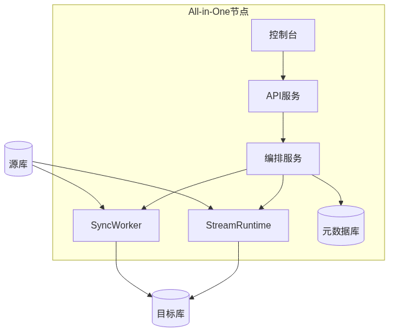
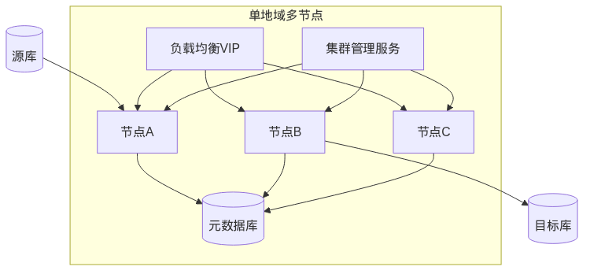

# 迁移平台软件设计说明书

| 属性 | 内容 |
|------|------|
| **文档名称** | 迁移平台软件设计说明书（SDD） |
| **文档版本** | v1.0 |
| **编制日期** | 2026-07-09 |
| **文档状态** | 评审稿 |
| **适用范围** | 通用异构数据迁移平台 |
| **关联文档** | [迁移平台总体设计](迁移平台总体设计.md)、[OMS架构参考](OMS架构参考.md) |

---

## 修订历史

| 版本 | 日期 | 修订人 | 修订说明 | 状态 |
|------|------|--------|----------|------|
| v1.0 | 2026-07-09 | — | 初稿：基于总体设计 v1.1 编制 SDD，完成架构、18 模块、流程与非功能设计 | 评审稿 |

---

## 目录

1. [引言](#1-引言)
2. [系统概述](#2-系统概述)
3. [系统架构设计](#3-系统架构设计)
4. [模块详细设计](#4-模块详细设计)
5. [流程设计](#5-流程设计)
6. [数据与接口设计](#6-数据与接口设计)
7. [调度与资源管理](#7-调度与资源管理)
8. [非功能设计](#8-非功能设计)
9. [附录](#9-附录)

---

## 1. 引言

### 1.1 编写目的

本文档为**通用异构数据迁移平台**的软件设计说明书（Software Design Document，SDD），在 [迁移平台总体设计](迁移平台总体设计.md) 基础上，将总体架构细化为可指导研发、测试与运维落地的模块级设计、流程设计与非功能约束。

读者对象：架构师、后端/前端开发、测试工程师、运维工程师及项目评审人员。

### 1.2 文档范围

本文档覆盖：

- 四层架构 + 数据平面的逻辑与部署设计
- 18 个核心模块的职责、接口边界与容错机制
- 标准迁移流程（结构 → 全量 → 增量 → 校验 → 切换）的状态机与衔接策略
- 插件体系、调度资源、监控告警及 HA 设计

不在本文档范围内：详细 API 字段级规范（另立接口文档）、各数据库插件实现细节、OMS 架构深度剖析（见 [OMS架构参考](OMS架构参考.md)）。

### 1.3 术语与缩略语

| 术语 | 说明 |
|------|------|
| DBCat / SchemaEngine | Schema 采集、类型映射与目标端 DDL 生成执行组件 |
| FullImport | 基于 DataX 的全量数据导入组件 |
| Store | 源端增量日志拉取、解析与持久化组件 |
| IncrSync | 增量 Record 应用至目标端组件（Flink CDC 运行时） |
| FullVerification | 源/目标全字段对比校验组件 |
| Supervisor | 组件健康监控与 HA 触发代理 |
| Record | 统一数据抽象：全量用 DataX Record，增量用 DML/DDL/HB |
| Checkpoint | Flink 分布式快照，用于增量作业故障恢复 |

### 1.4 参考文档

| 序号 | 文档 | 说明 |
|------|------|------|
| 1 | [迁移平台总体设计](迁移平台总体设计.md) | 总体架构与能力映射 |
| 2 | [OMS架构参考](OMS架构参考.md) | OceanBase OMS 架构借鉴与差异对照 |
| 3 | DataX 设计框架与模块分析 | 全量引擎参考 |
| 4 | Flink 设计框架与模块总结 | 增量引擎参考 |
| 5 | [Alibaba DataX](https://github.com/alibaba/DataX) | 开源全量同步框架 |
| 6 | [Apache Flink](https://flink.apache.org/) | 流处理与 CDC 运行时 |

---

## 2. 系统概述

### 2.1 背景

企业在数据库升级、云迁移、架构转型（集中式 → 分布式）过程中，普遍面临异构数据源、有限停机窗口、全增量衔接一致性及多阶段运维复杂度等挑战。现有方案各有侧重：DataX 擅长异构全量但不支持增量与结构迁移；Flink CDC 擅长实时增量但缺少产品化编排；OceanBase OMS 提供完整迁移产品能力但目标端绑定 OceanBase。

本平台融合 **OMS 产品化迁移流程**、**DataX 全量离线同步**与 **Flink CDC 增量实时同步**，构建开放目标端的端到端在线迁移能力。

### 2.2 设计目标

| 目标 | 指标/说明 |
|------|-----------|
| 端到端迁移 | 结构 → 全量 → 增量 → 校验 → 切换，一站式完成 |
| 低停机 | 增量同步期间业务可继续写入源端 |
| 数据一致性 | 全量位点与增量位点精确衔接，支持全字段校验 |
| 高可用 | Store/IncrSync 支持 HA，故障自动切换 |
| 可扩展 | 插件化 Reader/Writer/CDC Connector，快速接入新数据源 |
| 可观测 | 任务进度、吞吐、延迟、脏数据、差异数据全程可监控 |

### 2.3 设计原则

1. **分层解耦**：接入层、编排层、执行层、基础设施层职责清晰，各层可独立演进。
2. **双引擎互补**：全量用 DataX（离线高吞吐），增量用 Flink CDC（实时 Exactly-once）。
3. **插件即插即用**：新增数据源只需实现 Reader/Writer 或 CDC Connector。
4. **流程驱动**：以状态机编排迁移阶段，子任务可并行、可重试、可回滚。
5. **统一数据模型**：增量 Record 抽象为 DML/DDL/HB，屏蔽源端差异。

### 2.4 能力定位

| 能力维度 | 本平台 |
|----------|--------|
| 结构迁移 | SchemaEngine（DBCat） |
| 全量迁移 | FullImport（DataX） |
| 增量同步 | Store + IncrSync（Flink CDC） |
| 数据校验 | FullVerification |
| 可视化运维 | 统一控制台 + OpenAPI |
| 目标端 | 开放多种数据库，不绑定单一厂商 |

与 OMS、DataX、Flink 的能力对照及借鉴关系详见 [OMS架构参考](OMS架构参考.md)。

---

## 3. 系统架构设计

### 3.1 逻辑架构

平台采用 **四层架构 + 数据平面** 模型：服务接入层、流程编排层、执行引擎层、基础设施层，以及独立的源库/目标库/增量日志存储数据平面。


**图 3-1 系统逻辑架构图**

| 层次 | 核心职责 | 主要模块 |
|------|----------|----------|
| 服务接入层 | 用户交互、统一 API 入口、安全控制 | 控制台 UI、API 网关、认证鉴权 |
| 流程编排层 | 迁移流水线编排、子任务状态机、元数据与数据源管理 | 任务编排、工作流、元数据、数据源注册中心 |
| 执行引擎层 | 结构转换、全量导入、增量同步、数据校验的具体执行 | DBCat、FullImport、Store、IncrSync、FullVerification |
| 基础设施层 | 调度、资源池、HA、监控告警、元库与时序库 | 调度器、资源池、HA 组件、监控告警 |
| 数据平面 | 实际数据读写与日志持久化 | 源数据库、目标数据库、增量日志存储 |

### 3.2 模块组成


**图 3-2 模块组成图**

模块按职责划分为五组：**管理与接入**、**核心服务**、**执行组件**、**基础设施**、**插件与运行时**。控制台经 API 网关访问任务编排服务；编排服务驱动工作流，工作流调度各执行组件；执行组件依赖插件层与 DataX/Flink 运行时完成数据搬运。

### 3.3 控制平面与数据平面分离


**图 3-3 控制平面与数据平面分离图**

- **控制平面**：API 服务、编排引擎、调度器、元数据库，负责决策、配置与状态持久化。
- **数据平面**：执行引擎与源/目标数据库，负责实际数据读写。

两者通过调度器解耦：控制平面下发作业规格与调度指令，数据平面在 Worker/Flink 集群上执行，便于独立扩缩容与故障隔离。

### 3.4 部署架构

#### 3.4.1 单机开发模式



**图 3-4 单机部署架构图**

All-in-One 节点集成控制台、API、编排服务、DataX 引擎、Flink MiniCluster 与元数据库，适用于开发调试与 PoC 验证。

#### 3.4.2 单地域多节点 HA



**图 3-5 多节点 HA 部署架构图**

多节点经负载均衡/VIP 对外服务，集群管理服务（CM）负责组件注册与调度；Store/IncrSync 支持跨节点 HA 切换。控制台默认端口 8089（可配置）。

#### 3.4.3 多地域部署（V3）

Store 部署在源端地域，IncrSync 部署在目标端地域，协调层元数据库与 CM 跨地域统一管理。适用于跨地域容灾与异地多活场景。

### 3.5 技术选型

| 模块 | 建议技术 | 理由 |
|------|----------|------|
| 后端服务 | Java 17 + Spring Boot 3 | 与 DataX/Flink 生态一致 |
| 全量引擎 | 内嵌/调度 DataX | 70+ 插件，成熟异构离线同步 |
| 增量引擎 | Apache Flink + CDC Connectors | Exactly-once 与 Connector 生态 |
| 前端控制台 | React + Ant Design | 任务管理与监控大盘 |
| API 网关 | Spring Cloud Gateway | 鉴权、限流、路由 |
| 元数据库 | MySQL 8 / PostgreSQL | 任务配置、位点、映射关系 |
| 时序库 | Prometheus / InfluxDB | 指标存储与查询 |
| 协调服务 | ZooKeeper / etcd | HA 选主、组件注册 |
| 容器编排 | Kubernetes | 弹性调度、多节点部署 |

---

## 4. 模块详细设计

本章对 18 个核心模块给出统一设计描述。各模块均采用下列结构：**模块概述**、**设计思路**、**功能职责**、**输入/输出**、**依赖关系**、**关键机制**、**异常与容错**。

---

### 4.1 管理与接入模块

#### 4.1.1 控制台 UI

**模块概述**

Web 管理控制台，为 DBA/运维人员提供迁移任务全生命周期可视化管理能力，是平台主要人机交互入口。

**设计思路**

采用前后端分离架构，前端 SPA 通过 API 网关访问后端服务；页面按「项目 → 任务 → 子任务」层级组织，与编排层任务模型一致。监控大盘复用时序库指标，任务向导引导用户完成预检查、映射配置与阶段操作。

**功能职责**

| 功能域 | 说明 |
|--------|------|
| 任务向导 | 创建迁移项目、配置源/目标、选择对象与同步策略 |
| 进度大盘 | 展示各阶段状态、吞吐、延迟、已完成表数/行数 |
| 日志查看 | 子任务运行日志、组件日志聚合检索 |
| 告警配置 | 告警规则、通知渠道、静默策略 |
| 系统管理 | HA 参数、资源配额、插件目录浏览 |

**输入/输出**

| 方向 | 内容 |
|------|------|
| 输入 | 用户操作事件、查询/筛选条件、告警规则配置 |
| 输出 | REST 请求至 API 网关；渲染任务状态、指标图表、差异报告 |

**依赖关系**

- 上游：用户浏览器
- 下游：API 网关
- 间接依赖：元数据服务（经 API 获取任务与配置）

**关键机制**

- 基于 RBAC 的菜单与按钮级权限控制
- WebSocket/SSE 推送任务状态变更，降低轮询压力
- 大表进度采用增量拉取 + 本地缓存

**异常与容错**

- API 超时：前端重试与友好降级提示
- 会话过期：跳转登录并保留草稿配置
- 指标服务不可用：展示最近缓存快照并标注数据延迟

---

#### 4.1.2 API 网关

**模块概述**

平台统一北向入口，对外暴露 RESTful OpenAPI，对内路由至编排、元数据等微服务。

**设计思路**

参考 OMS 调度服务端口模式，网关承担横切关注点：鉴权、限流、路由、版本管理与请求审计，业务服务专注领域逻辑。支持 CLI/SDK 与控制台共用同一套 API。

**功能职责**

| 功能 | 说明 |
|------|------|
| 路由转发 | 按路径将请求分发至编排、元数据、监控等服务 |
| 鉴权集成 | 校验 Token，注入租户与用户上下文 |
| 限流熔断 | 按租户/API 维度限流，保护后端 |
| 版本管理 | `/api/v1`、`/api/v2` 多版本共存 |
| 审计日志 | 记录写操作请求体摘要与操作者 |

**输入/输出**

| 方向 | 内容 |
|------|------|
| 输入 | HTTP/HTTPS 请求（控制台、CLI、第三方系统） |
| 输出 | 路由后的内部服务调用；统一 JSON 响应封装 |

**依赖关系**

- 上游：控制台 UI、CLI/SDK、外部系统集成
- 下游：任务编排服务、元数据服务、认证鉴权模块
- 基础设施：服务注册发现（K8s Service / Nacos 等）

**关键机制**

- JWT/OAuth2 无状态鉴权，网关校验后透传 `X-Tenant-Id`、`X-User-Id`
- 幂等键（`Idempotency-Key`）支持任务创建等写操作防重
- 全局异常处理器统一错误码

**异常与容错**

- 后端不可用：熔断返回 503，附带 `Retry-After`
- 限流触发：返回 429 与配额说明
- 单服务超时：可配置重试与超时阈值

---

#### 4.1.3 认证鉴权

**模块概述**

提供身份认证、RBAC 授权、多租户隔离与操作审计，保障平台多租户环境下的安全合规。

**设计思路**

认证与业务解耦：网关完成 Token 校验，鉴权服务提供角色-权限-资源三元模型。租户 ID 贯穿任务、数据源与资源配额，实现逻辑隔离。敏感操作（删除任务、业务切换）需二次确认或更高权限。

**功能职责**

| 功能 | 说明 |
|------|------|
| 身份认证 | 用户名密码、LDAP/SSO 集成 |
| RBAC | 角色、权限、用户-角色绑定 |
| 多租户 | 租户注册、配额、数据隔离 |
| 操作审计 | 记录谁、何时、对何资源、执行何操作 |
| 凭证代理 | 数据源密码加密存储，执行组件按需解密 |

**输入/输出**

| 方向 | 内容 |
|------|------|
| 输入 | 登录凭证、权限校验请求、审计事件 |
| 输出 | Access Token、权限判定结果、审计记录 |

**依赖关系**

- 被依赖：API 网关、任务编排服务、数据源注册中心
- 依赖：元数据库（用户/角色/审计表）、密钥管理服务（KMS）

**关键机制**

- 数据源凭证 AES 加密 + 租户级密钥
- 权限模型：`资源类型:操作`（如 `migration_task:start`）
- 审计日志异步写入，不阻塞主链路

**异常与容错**

- KMS 不可用：拒绝新凭证写入，已有任务只读
- 鉴权服务超时：网关默认拒绝（fail-close）
- 审计队列积压：本地缓冲 + 降级批量刷盘

---

### 4.2 核心服务模块

#### 4.2.1 任务编排服务

**模块概述**

迁移任务全生命周期管理的核心域服务，承载 MigrationProject / MigrationTask 模型及用户可见的任务状态。

**设计思路**

编排服务作为控制平面「大脑」，不直接搬运数据，而是维护任务意图、驱动工作流、协调元数据与调度器。对标 OMS 控制台背后的任务管理能力，并扩展开放目标端与双引擎调度。

**功能职责**

| 功能 | 说明 |
|------|------|
| 任务 CRUD | 创建、查询、修改、删除迁移项目/任务 |
| 生命周期控制 | 启动、暂停、恢复、终止、重试 |
| 预检查 | 连通性、权限、版本兼容性检查 |
| 阶段门控 | 校验前一子任务成功后才允许进入下一阶段 |
| 统计聚合 | 汇总子任务进度供控制台展示 |

**输入/输出**

| 方向 | 内容 |
|------|------|
| 输入 | API 任务操作、工作流回调、Supervisor 告警 |
| 输出 | 工作流启动指令、调度请求、任务状态变更事件 |

**依赖关系**

- 上游：API 网关
- 下游：工作流服务、元数据服务、数据源注册中心、调度器
- 协作：监控告警（状态变更触发告警）

**关键机制**

- 乐观锁更新任务状态，防止并发操作冲突
- 领域事件发布（任务阶段变更）供监控与审计订阅
- 预检查项可插件化扩展

**异常与容错**

- 工作流启动失败：任务回滚至 `Created`，记录失败原因
- 元数据写入失败：事务回滚，API 返回 500
- 重复启动：幂等校验，已运行任务拒绝再次启动

---

#### 4.2.2 工作流服务

**模块概述**

子任务流水线编排引擎，以状态机驱动结构、全量、增量、校验、切换各阶段的依赖关系与并行策略。

**设计思路**

将迁移流程建模为有向阶段图 + 子任务状态机，对标 OMS 流程编排层与 Flink JobGraph 调度思想。每个 SubTask 映射到具体执行组件（DBCat、FullImport 等），由工作流负责就绪判定、并行拆分与失败重试策略。

**功能职责**

| 功能 | 说明 |
|------|------|
| 状态机驱动 | 维护 SubTask 状态迁移（Pending/Running/Success/Failed） |
| 依赖管理 | 阶段间前置条件（如 SchemaDone → FullMigrating） |
| 并行策略 | 全量/校验表级并行，增量单链路 |
| 失败处理 | 重试、人工介入、Repairing 订正回路 |
| 组件绑定 | 为 SubTask 选择执行节点与运行时 |

**输入/输出**

| 方向 | 内容 |
|------|------|
| 输入 | 编排服务阶段推进指令、执行组件完成回调 |
| 输出 | 组件启动命令、SubTask 状态、阶段完成事件 |

**依赖关系**

- 上游：任务编排服务
- 下游：DBCat、FullImport、Store、IncrSync、FullVerification、调度器
- 依赖：元数据服务（SubTask 状态持久化）

**关键机制**

- 基于 DAG 的子任务依赖解析
- 表级 SubTask 动态拆分与合并进度
- 与调度器协同：先申请资源再启动组件

**异常与容错**

- 组件启动超时：SubTask 标记 Failed，支持重试
- 部分表全量失败：可配置「失败即停」或「跳过失败表」
- 状态不一致：以元数据库为准，定时对账修复

---

#### 4.2.3 元数据服务

**模块概述**

平台配置与运行状态的权威持久化服务，管理任务配置、位点、Schema 映射、统计指标与组件注册信息。

**设计思路**

集中式元数据避免各执行组件各自维护状态导致脑裂。借鉴 OMS 元数据库（`drc_rm_db`、`drc_cm_db` 等）划分思路，按域分表：任务域、位点域、映射域、组件域、指标域。

**功能职责**

| 功能 | 说明 |
|------|------|
| 任务配置 | 源/目标、对象列表、同步参数、限速配置 |
| 位点管理 | 全量 `startPosition`、Store 消费位点、Flink Checkpoint 引用 |
| 映射元数据 | 表/列名映射、类型映射结果 |
| 组件注册 | Store/IncrSync 实例与所在节点 |
| 运行统计 | 已完成行数、表数、脏数据计数 |

**输入/输出**

| 方向 | 内容 |
|------|------|
| 输入 | 各服务读写请求、组件心跳与位点上报 |
| 输出 | 配置查询结果、位点快照、映射 DDL 记录 |

**依赖关系**

- 被依赖：编排、工作流、各执行组件、Supervisor、HA 组件
- 依赖：元数据库（MySQL/PostgreSQL）

**关键机制**

- 位点双写：组件本地缓存 + 元数据库持久化
- 映射版本号：结构变更后递增，供增量识别
- 软删除任务，保留审计追溯

**异常与容错**

- 数据库主从切换：连接池自动重连，读可降级从库
- 位点写入冲突：以时间戳较新者为准并告警
- 大批量统计更新：异步批量刷盘

---

#### 4.2.4 数据源注册中心

**模块概述**

统一管理源端与目标端数据库连接信息，提供连通性检测、连接池与凭证安全存储。

**设计思路**

数据源与迁移任务解耦，同一数据源可被多个任务引用。连接参数经认证鉴权加密后存储，执行组件通过内部 API 按任务授权获取连接句柄，避免明文扩散。

**功能职责**

| 功能 | 说明 |
|------|------|
| 数据源 CRUD | 注册、更新、删除、测试连接 |
| 连接池 | 按数据源维护可复用连接池 |
| 连通性检测 | 预检查阶段验证网络与账号权限 |
| 类型识别 | 自动识别数据库类型与版本 |
| 引用计数 | 被任务引用时禁止删除 |

**输入/输出**

| 方向 | 内容 |
|------|------|
| 输入 | 连接串、凭证、JDBC 扩展参数 |
| 输出 | 数据源 ID、连接测试结果、受控连接获取接口 |

**依赖关系**

- 上游：控制台、任务编排服务
- 下游：DBCat、FullImport、Store、FullVerification（经内部 API）
- 依赖：认证鉴权（加解密）、元数据库

**关键机制**

- 连接探活定时任务，标记不可用数据源
- 按租户隔离数据源命名空间
- SSL/TLS 证书集中配置

**异常与容错**

- 连接失败：返回明确错误码（网络/认证/权限）
- 连接池耗尽：排队等待或快速失败并告警
- 凭证轮换：支持在线更新，不影响运行中任务需版本化配置

---

### 4.3 执行组件

#### 4.3.1 DBCat（SchemaEngine）

**模块概述**

结构迁移执行组件，负责源端 Schema 采集、异构类型映射、目标端 DDL 生成与执行。

**设计思路**

借鉴 OMS DBCat，将结构迁移从「脚本导出」升级为可规则化的 Schema 转换引擎。对目标端不支持的对象降级或跳过并告警，复杂场景支持导出 SQL 供 DBA 人工修订后导入。

**功能职责**

| 功能 | 说明 |
|------|------|
| 元数据采集 | 表、索引、约束、视图、序列等 |
| 语法解析 | 按源端方言解析对象定义 |
| 类型映射 | 调用 TypeMapper 完成跨库类型转换 |
| DDL 生成与执行 | 在目标端创建对象 |
| 映射持久化 | 将映射结果写入元数据服务 |

**输入/输出**

| 方向 | 内容 |
|------|------|
| 输入 | 任务 ID、源/目标数据源、对象清单、映射规则 |
| 输出 | 执行日志、映射元数据、SubTask 完成状态 |

**依赖关系**

- 上游：工作流服务
- 下游：源/目标数据库
- 依赖：数据源注册中心、元数据服务、TypeMapper 插件

**关键机制**

- 对象级并行采集，DDL 按依赖顺序拓扑执行
- 映射规则可覆盖（表名、列名、类型）
- 不支持对象清单输出供人工处理

**异常与容错**

- DDL 执行失败：记录失败对象，支持跳过或中止
- 不支持 HA：失败后由工作流触发人工重试
- 目标端已存在对象：可配置 `skip` / `replace` / `error`

---

#### 4.3.2 FullImport

**模块概述**

全量数据迁移执行组件，基于 DataX 实现异构库间高吞吐离线同步。

**设计思路**

选用 DataX 而非自研全量引擎，复用 70+ Reader/Writer 插件与成熟的 Channel 流控、脏数据处理能力。平台负责将任务配置**自动生成** DataX `job.json`，并管理 Task/TaskGroup 并发参数。切片 ACK 机制在平台层补充，参考 OMS Full-Import 重启保障。

**功能职责**

| 功能 | 说明 |
|------|------|
| 作业生成 | 根据映射元数据生成 DataX job 配置 |
| 表级切片 | 按主键/分区切分 Task |
| 并发调度 | TaskGroup、Channel 并发控制 |
| 限速与脏数据 | 令牌桶限速、errorLimit 脏数据上限 |
| 位点记录 | 全量启动时记录源端 binlog/redo 位点 |

**输入/输出**

| 方向 | 内容 |
|------|------|
| 输入 | 任务配置、表清单、并发度、限速参数 |
| 输出 | 运行统计（byteSpeed/recordSpeed）、`startPosition`、SubTask 状态 |

**依赖关系**

- 上游：工作流服务、调度器
- 下游：DataX 运行时、Reader/Writer 插件
- 依赖：元数据服务、数据源注册中心

**关键机制**

- **1:1 Reader-Writer Task 配对**；**Writer 先启动**防数据丢失
- Channel 数限制 TaskGroup 内并发，Task 可排队
- 全量开始时写入 `startPosition` 供 Store 衔接

**异常与容错**

- Task Failover：DataX `maxRetryTimes` 自动重试
- 脏数据超限：按 errorLimit 中止并告警
- 不支持 HA：作业级失败后人工重试整表或整个全量阶段

---

#### 4.3.3 Store

**模块概述**

增量日志拉取组件，从源端 binlog/redo 等读取变更，解析为统一 DML/DDL/HB Record 并持久化。

**设计思路**

借鉴 OMS Store，将源端差异屏蔽在 Store 之内，向下游 IncrSync 输出统一 Record 流。支持 per-task 独立 Store；V2 规划同源多任务 Store 共享。Store 是增量链路起点，也是全量与增量的**位点衔接锚点**。

**功能职责**

| 功能 | 说明 |
|------|------|
| 日志拉取 | MySQL Binlog、Oracle Redo、OB Liboblog 等 |
| 日志解析 | 结合 Schema 解析为 Record |
| 持久化 | 写入 Record 队列或日志存储 |
| 位点管理 | 维护消费/生产位点并上报元数据 |
| 心跳 | 输出 HB Record 供延迟检测 |

**输入/输出**

| 方向 | 内容 |
|------|------|
| 输入 | 数据源连接、`startPosition`、订阅表清单 |
| 输出 | DML/DDL/HB Record 流、位点、组件心跳 |

**依赖关系**

- 上游：工作流服务（全量完成后启动）
- 下游：IncrSync（或 Kafka 消息队列，可选）
- 依赖：元数据服务、数据源注册中心、CDC 连接器/源端适配器
- 协作：Supervisor、HA 组件

**关键机制**

- 从全量 `startPosition` 开始拉取，保证不丢变更
- 事务边界解析，保证 Record 顺序语义
- 支持 HA：异常时在健康节点重建（见 4.4.3）

**异常与容错**

- **支持 HA**：宕机后其他节点重建 Store，按配置回退位点
- 源端日志清理：位点滞后告警，提示扩容或加速消费
- 解析异常：隔离脏 Record 并计数

---

#### 4.3.4 IncrSync

**模块概述**

增量同步执行组件，将 Store 产生的 Record 应用至目标端，运行时基于 Flink CDC 作业。

**设计思路**

融合 OMS Incr-Sync 产品与 Flink Exactly-once 能力。有主键表依赖幂等写入；无主键表 V2 引入事务表机制。Flink Checkpoint 持久化消费位点，与 Store 位点协同。

**功能职责**

| 功能 | 说明 |
|------|------|
| Record 消费 | 从 Store/队列读取 DML/DDL/HB |
| 转换应用 | 类型转换、表名映射、DDL 同步 |
| 目标写入 | INSERT/UPDATE/DELETE 及 DDL 执行 |
| Checkpoint | 定期快照，故障恢复 |
| 延迟上报 | 基于 HB 与位点差计算同步延迟 |

**输入/输出**

| 方向 | 内容 |
|------|------|
| 输入 | Record 流、映射配置、目标数据源 |
| 输出 | 应用结果、Checkpoint 位点、延迟指标 |

**依赖关系**

- 上游：Store
- 下游：Flink 集群、目标数据库
- 依赖：元数据服务、CDC 连接器、Writer 能力
- 协作：Supervisor、HA 组件

**关键机制**

- 统一 Record：DML / DDL / HB
- Flink Checkpoint + Savepoint 恢复
- DDL 与 DML 分流处理，防止结构不一致

**异常与容错**

- **支持 HA**：进程异常重启（10 分钟冷却）；节点宕机跨机重建
- 注意：宕机恢复后可能存在短暂双写，依赖目标端幂等
- 无主键表：官方限制场景不保证一致性，预检查提示

---

#### 4.3.5 FullVerification

**模块概述**

数据校验组件，对源端与目标端进行全字段、分片并行对比，输出差异报告与订正 SQL。

**设计思路**

借鉴 OMS Full-Verification，在增量延迟降至阈值后触发。流式读取避免大表内存爆炸；内部格式化屏蔽异构类型差异；支持多轮复检降低误报。

**功能职责**

| 功能 | 说明 |
|------|------|
| 分片对比 | 按主键/索引切分并行校验 |
| 流式读取 | 源/目标端流式拉取 |
| 格式化比较 | 统一类型后逐行对比 |
| 差异输出 | 差异文件、订正 SQL |
| 复检循环 | Repairing → Verifying 回路 |

**输入/输出**

| 方向 | 内容 |
|------|------|
| 输入 | 校验表清单、分片大小、增量延迟阈值 |
| 输出 | 差异报告、订正 SQL、SubTask 状态 |

**依赖关系**

- 上游：工作流服务（增量追平后触发）
- 下游：源/目标数据库
- 依赖：元数据服务、数据源注册中心

**关键机制**

- 增量延迟低于阈值才启动，避免误报
- 表级并行，与全量类似可配置并发度
- 差异订正后可自动进入复检

**异常与容错**

- 不支持 HA：失败后人工重试
- 单分片超时：跳过并标记待重验
- 持续差异：工作流进入 Repairing，阻塞切换

---

#### 4.3.6 Supervisor

**模块概述**

组件健康监控代理，定时心跳上报，检测 Store/IncrSync 等组件异常并触发 HA 流程。

**设计思路**

对标 OMS `oms_drc_supervisor`，每台 Worker 节点部署 Supervisor 进程，与 HA 组件协同。将「检测」与「恢复」分离：Supervisor 负责发现，HA 组件负责决策与执行。

**功能职责**

| 功能 | 说明 |
|------|------|
| 心跳上报 | 向元数据库定时汇报节点与组件存活 |
| 健康检查 | 检测 Store/IncrSync 进程与端口 |
| 异常检测 | 超时无心跳判定组件异常 |
| HA 触发 | 通知 HA 组件执行切换/重建 |
| 指标采集 | 采集本地组件基础指标 |

**输入/输出**

| 方向 | 内容 |
|------|------|
| 输入 | 本地组件状态、HA 配置参数 |
| 输出 | 心跳记录、HA 触发事件、监控指标 |

**依赖关系**

- 监控对象：Store、IncrSync 等节点级组件
- 协作：HA 组件、元数据服务、监控告警

**关键机制**

- 可配置心跳间隔与宕机判定阈值（默认参考 OMS 540s）
- 与 HA 开关联动（`enable`、`enableStore`、`enableConnector`）
- 机器级与组件级检测分层

**异常与容错**

- Supervisor 自身异常：由节点监控（K8s liveness）重启
- 网络分区：依赖元数据库时间戳与 quorum 策略防脑裂
- HA 冷却期：同一对象最小操作间隔（默认 600s）

---

### 4.4 基础设施模块

#### 4.4.1 调度器

**模块概述**

接收编排/工作流下发的作业调度请求，结合资源池状态将全量、增量等作业分配到合适 Worker/Flink 集群。

**设计思路**

对标 OMS 调度服务（8088）与 Flink ResourceManager，调度器是控制平面与数据平面的**衔接枢纽**。支持优先级、公平、亲和与弹性策略。

**功能职责**

| 功能 | 说明 |
|------|------|
| 作业排队 | 优先级队列管理待调度作业 |
| 资源匹配 | 根据作业需求匹配 Worker/Slot |
| 亲和调度 | Store 靠近源端，IncrSync 靠近目标端 |
| 弹性触发 | 队列深度驱动 Worker 扩缩容 |
| 作业生命周期 | 提交、监控、完成、失败回收 |

**输入/输出**

| 方向 | 内容 |
|------|------|
| 输入 | 工作流调度请求、资源池状态 |
| 输出 | Worker 作业分配、Flink Job 提交句柄 |

**依赖关系**

- 上游：工作流服务、任务编排服务
- 下游：资源池、DataX 运行时、Flink 集群
- 依赖：元数据服务（作业状态）

**关键机制**

- 多队列：全量队列、增量队列分离
- 租户配额：超配额作业排队
- 失败重调度：节点失效时自动重新分配

**异常与容错**

- 无可用资源：作业排队并告警
- 调度器主备：基于 etcd/ZK 选主
- 作业提交失败：指数退避重试

---

#### 4.4.2 资源池

**模块概述**

统一管理 DataX Worker 进程与 Flink Slot 等计算资源，提供配额、隔离与弹性能力。

**设计思路**

将 Worker 节点池与 Flink 集群抽象为统一资源视图，供调度器消费。参考 OMS 资源池管理，支持按租户/项目限制 CPU、内存与并发作业数。

**功能职责**

| 功能 | 说明 |
|------|------|
| 资源注册 | Worker 节点上线/下线登记 |
| 配额管理 | 租户级 CPU/内存/作业数上限 |
| 资源隔离 | 按项目或租户划分资源池 |
| 弹性伸缩 | 对接 K8s HPA 或 YARN 弹性 |
| 使用率上报 | 供调度与监控决策 |

**输入/输出**

| 方向 | 内容 |
|------|------|
| 输入 | 节点注册、心跳、配额配置 |
| 输出 | 可用资源快照、分配/释放确认 |

**依赖关系**

- 上游：调度器
- 下游：DataX Worker 节点池、Flink 集群
- 依赖：元数据服务、监控告警

**关键机制**

| 资源类型 | 分配单位 |
|----------|----------|
| DataX Worker | 进程/容器，每全量 Job 一个 Worker |
| Flink Slot | Slot，每增量作业若干 Slot |
| CPU/内存 | 租户配额 |

**异常与容错**

- 节点失联：标记不可用，调度器迁移作业
- 配额耗尽：拒绝新作业并返回明确错误
- 超卖保护：预留系统缓冲资源

---

#### 4.4.3 HA 组件

**模块概述**

高可用决策与执行模块，在 Store/IncrSync 异常或节点宕机时自动触发重建、切换与注册信息更新。

**设计思路**

直接借鉴 [OMS架构参考](OMS架构参考.md) 中的 HA 逻辑与 `ha.config` 参数体系。默认建议生产环境开启 HA；与 Supervisor 配合完成「检测 → 决策 → 执行」闭环。

**功能职责**

| 功能 | 说明 |
|------|------|
| 宕机检测 | 心跳超时判定机器宕机 |
| Store HA | 健康节点重建 Store，计算回退位点 |
| IncrSync HA | 重启或跨节点重建，冷却期控制 |
| 注册维护 | 删除故障节点组件注册，更新元数据 |
| 配置管理 | `enable`、`enableHost`、`enableStore` 等 |

**输入/输出**

| 方向 | 内容 |
|------|------|
| 输入 | Supervisor 告警、元数据组件注册表、HA 配置 |
| 输出 | 组件重建指令、注册表变更、HA 操作审计 |

**依赖关系**

- 上游：Supervisor
- 下游：Store、IncrSync、调度器
- 依赖：元数据服务、协调服务（etcd/ZK）

**关键机制**

| 组件 | HA 支持 | 异常行为 |
|------|---------|----------|
| Store | ✅ | 其他节点重建，按位点回退策略启动 |
| IncrSync | ✅ | 重启或重建，10 分钟冷却 |
| FullImport | ❌ | 人工重试 |
| FullVerification | ❌ | 人工重试 |

Store 新建位点：`perceiveStoreClientCheckpoint` 为 false 时取「当前时间 − refetchStoreIntervalMin」；为 true 时取「下游最早消费位点 − refetchStoreIntervalMin」。

**异常与容错**

- HA 操作间隔：`checkRequestIntervalSec` 防止抖动
- Store 数量达上限：放弃 HA 并告警
- 双写风险：切换后提示校验增量幂等配置

---

#### 4.4.4 监控告警

**模块概述**

采集、存储、可视化全链路指标，并按规则触发告警通知。

**设计思路**

融合 DataX Communication 统计、Flink Metrics 与 Supervisor 心跳，写入时序库（Prometheus/InfluxDB），经 Grafana 大盘展示。AlertManager 对接邮件、钉钉、Webhook。

**功能职责**

| 功能 | 说明 |
|------|------|
| 指标采集 | 吞吐、延迟、进度、脏数据、资源使用率 |
| 存储查询 | 时序库写入与 PromQL 查询 |
| 可视化 | Grafana 大盘、控制台嵌入图表 |
| 告警规则 | 阈值、持续时间、级别 |
| 通知分发 | 多渠道告警路由 |

**输入/输出**

| 方向 | 内容 |
|------|------|
| 输入 | 各组件指标推送、心跳事件 |
| 输出 | 告警事件、大盘数据、Webhook 通知 |

**依赖关系**

- 上游：FullImport、IncrSync、Store、Supervisor、资源池
- 下游：时序库、AlertManager、控制台
- 协作：任务编排服务（任务失败联动）

**关键机制**

| 类别 | 代表指标 |
|------|----------|
| 吞吐 | byteSpeed、recordSpeed |
| 延迟 | 增量同步延迟（秒） |
| 进度 | 已完成表数/行数 |
| 质量 | 脏数据数、差异行数 |
| 健康 | 组件状态、心跳 |

| 告警项 | 条件 | 级别 |
|--------|------|------|
| 任务失败 | SubTask → Failed | P0 |
| 增量延迟过高 | 延迟 > 60s 持续 5min | P1 |
| 脏数据超限 | 占比 > errorLimit | P1 |
| 校验差异 | 差异行数 > 0 | P2 |
| 组件异常 | Supervisor 检测不可用 | P0 |

**异常与容错**

- 时序库不可用：本地缓冲指标，恢复后补写
- 告警风暴：分组、抑制与静默规则
- 采集代理故障：降级为核心指标采集

---

### 4.5 插件与运行时

#### 4.5.1 Reader/Writer 插件

**模块概述**

DataX 风格的数据读取与写入插件，实现异构数据源的全量数据接入与写出。

**设计思路**

沿用 DataX SPI（`Job.init/split`、`Task.startRead/startWrite`），通过 `plugin.json` 注册。平台插件注册中心统一校验兼容性并供 FullImport 加载。ClassLoader 隔离避免依赖冲突。

**功能职责**

| 插件类型 | 职责 |
|----------|------|
| Reader | 源端数据切分与读取，推送 Record 至 Channel |
| Writer | 从 Channel 接收 Record 写入目标端 |
| Transformer（可选） | 脱敏、过滤、字段转换 |

**输入/输出**

| 方向 | 内容 |
|------|------|
| 输入 | DataX Task 配置、数据源连接 |
| 输出 | DataX Record 流（Reader）或写入确认（Writer） |

**依赖关系**

- 被依赖：FullImport、DataX 运行时
- 依赖：数据源注册中心、插件注册中心

**关键机制**

- `plugin.json` 元信息与 `plugin_job_template.json` 模板
- 严格 1:1 Reader-Writer Task 配对
- 能力矩阵：MySQL、Oracle、PostgreSQL、OceanBase 等（详见 6.2 节）

**异常与容错**

- 读取超时：Task 级 Failover
- 类型不兼容：脏数据记录 + errorLimit 控制
- 插件加载失败：作业启动前校验，快速失败

---

#### 4.5.2 CDC 连接器

**模块概述**

Flink FLIP-27 风格 CDC Source/Sink 连接器，为 Store 与 IncrSync 提供源端变更捕获与目标端写入能力。

**设计思路**

复用 Flink CDC 生态（mysql-cdc、oracle-cdc 等），统一 `Source/Sink + SplitEnumerator` 接口。Store 可内嵌连接器拉取日志，或由 Flink Source 直接消费。

**功能职责**

| 功能 | 说明 |
|------|------|
| 变更捕获 | 源端 binlog/redo 订阅 |
| Split 管理 | 分片枚举与分配 |
| 位点提交 | Checkpoint 对齐 |
| Schema 变更 | 处理源端 DDL 事件 |

**输入/输出**

| 方向 | 内容 |
|------|------|
| 输入 | 连接器配置、起始位点、表过滤规则 |
| 输出 | Flink Row/Record 流、Enumerator Checkpoint |

**依赖关系**

- 被依赖：Store、IncrSync、Flink 集群
- 依赖：数据源注册中心、元数据服务（Schema）

**关键机制**

- `META-INF/services/org.apache.flink.table.factories.Factory` SPI 注册
- Exactly-once 与 Checkpoint 对齐
- 与统一 DML/DDL/HB 模型转换层衔接

**异常与容错**

- 位点不可用：回退至最近有效 Snapshot
- Schema 不兼容：暂停作业并告警
- 连接器版本不匹配：启动前兼容性校验

---

#### 4.5.3 DataX 运行时

**模块概述**

执行 DataX 全量 Job 的运行时环境，包含 JobContainer、TaskGroup、Channel 与通信统计模块。

**设计思路**

可内嵌于 Worker 进程或由调度器拉起独立 JVM。平台屏蔽 DataX 命令行细节，以「全量作业」抽象对外。继承 DataX 流控、脏数据与 Communication 统计机制。

**功能职责**

| 功能 | 说明 |
|------|------|
| 作业解析 | 加载 job.json，初始化 JobContainer |
| 任务切分 | split → TaskGroup → Task 执行 |
| 通道管理 | MemoryChannel 与并发控制 |
| 流控统计 | 令牌桶限速、byteSpeed/recordSpeed |
| 生命周期 | 启停、进度上报、完成回调 |

**输入/输出**

| 方向 | 内容 |
|------|------|
| 输入 | job.json、插件 JAR、Worker 资源配额 |
| 输出 | 运行统计、完成/失败回调、脏数据报告 |

**依赖关系**

- 上游：调度器、FullImport
- 下游：Reader/Writer 插件
- 依赖：资源池（Worker 节点）

**关键机制**

- Writer 先于 Reader 启动
- Channel 数 ≠ Task 数：Task 排队
- 平台自动生成 job.json，用户零感知 DataX 配置

**异常与容错**

- Task Failover：`maxRetryTimes`
- OOM：限制 Channel 缓冲与并发度
- 进程崩溃：调度器在其他 Worker 重新提交

---

#### 4.5.4 Flink 集群

**模块概述**

增量 CDC 作业的分布式流处理运行时，提供 Slot 管理、Checkpoint 与 Savepoint 能力。

**设计思路**

支持 Session 与 Application 模式部署。迁移场景以低延迟、Exactly-once 为主，Checkpoint 间隔可配置。与资源池集成上报 Slot 使用率。

**功能职责**

| 功能 | 说明 |
|------|------|
| Job 提交 | 接收 IncrSync 生成的 Flink JobGraph |
| 资源管理 | JobManager/TaskManager、Slot 分配 |
| Checkpoint | 周期性分布式快照 |
| Savepoint | 版本升级与手动恢复 |
| Web UI | Flink 原生监控（可集成至控制台） |

**输入/输出**

| 方向 | 内容 |
|------|------|
| 输入 | JobGraph/JAR、并行度、Checkpoint 配置 |
| 输出 | 作业状态、Checkpoint 元数据、指标 |

**依赖关系**

- 上游：调度器、IncrSync
- 下游：CDC 连接器、目标数据库
- 依赖：资源池、元数据服务（位点引用）

**关键机制**

- Checkpoint 持久化至 HDFS/S3
- 并行度与 Slot 数匹配
- Savepoint 用于 HA 重建后状态恢复

**异常与容错**

- TaskManager 失败：自动重启 Task
- JobManager HA：ZK 选主
- Checkpoint 连续失败：作业暂停并告警

---

## 5. 流程设计

### 5.1 标准迁移流程


**图 5-1 标准迁移流程图**

完整在线迁移包含：**创建任务 → 预检查 → 结构迁移 → 全量迁移 → 增量同步 → 数据校验 → 业务切换**（可选反向增量，V3 规划）。

### 5.2 流程设计 rationale：为何是「结构 → 全量 → 增量 → 校验 → 切换」

该顺序并非随意排列，而是由**数据依赖**、**一致性约束**与**停机最小化**三类目标共同决定：

| 阶段 | 必须先于后续的原因 |
|------|-------------------|
| **结构迁移** | 目标端必须具备与源端语义对齐的表、索引与约束，全量与增量写入才有承载对象；否则 Writer 无法建表或写入违反约束。 |
| **全量迁移** | 在增量启动前，需将历史存量数据搬至目标端；若跳过全量直接增量，目标端缺少基线数据，仅增量变更无法还原完整数据集。 |
| **增量同步** | 全量期间源端持续写入，全量结束至切换前的变更需通过增量追平；全量记录的 `startPosition` 保证「全量起点之后、增量覆盖之前」的变更不丢失。 |
| **数据校验** | 结构+全量+增量完成后，需独立验证源/目标一致；必须在切换前完成，否则错误数据进入生产。校验前等待增量延迟降至阈值，避免「正在追平」导致的假差异。 |
| **业务切换** | 仅当校验通过后才切换 DNS/连接串并停止源端写入，将停机窗口压缩至切换瞬间；提前切换会导致双写与一致性问题。 |

简言之：**先有保障写入的容器（结构），再有存量基线（全量），再补运行期变更（增量），再独立验真（校验），最后一切就绪才切流量（切换）**。

### 5.3 任务状态机


**图 5-2 迁移任务状态机**

**任务层次模型**：

```text
MigrationProject（迁移项目）
  └── MigrationTask（迁移任务，一对源→目标）
        ├── SubTask: SchemaMigration（结构迁移）
        ├── SubTask: FullMigration（全量迁移，可按表并行）
        ├── SubTask: IncrementalSync（增量同步，单链路）
        ├── SubTask: Verification（数据校验，可按表并行）
        └── SubTask: Switchover（业务切换）
```

主状态迁移：`Created → SchemaMigrating → SchemaDone → FullMigrating → FullDone → IncrStarting → IncrSyncing → Verifying → VerifyDone → Switching → Completed`。异常路径进入 `Failed`；校验发现差异进入 `Repairing → Verifying` 复检回路。

### 5.4 阶段衔接机制

| 阶段转换 | 衔接机制 | 责任模块 |
|----------|----------|----------|
| 预检查 → 结构 | 权限、网络、版本检查全部通过 | 任务编排服务 |
| 结构 → 全量 | 结构完成锁定表结构；全量按映射后表名读取；元数据写入映射版本 | DBCat → FullImport |
| 全量 → 增量 | 全量**开始时**记录 `startPosition`；全量结束后 Store 从该位点拉取；Writer 先启后停保证无空洞 | FullImport → Store → IncrSync |
| 增量 → 校验 | 增量延迟 < 配置阈值；可多轮触发 | IncrSync → FullVerification |
| 校验 → 切换 | 差异为 0 或已订正复检通过；执行连接串/DNS 切换 | FullVerification → 编排服务 |
| 切换 → 完成 | 停止源端写入（可选）；任务归档 | 任务编排服务 |

**位点衔接**是全文量增量的技术关键：

1. 全量启动瞬间记录源端 binlog/redo 位点 `startPosition`
2. 全量执行期间源端变更由日志保留
3. 全量结束后 Store 从 `startPosition` 开始消费，覆盖全量期间的并发写入
4. Flink Checkpoint 持久化 IncrSync 消费位点，与 Store 协同

### 5.5 并行与串行策略

| 阶段 | 策略 | 理由 |
|------|------|------|
| 结构迁移 | **串行**（对象依赖拓扑序） | 表间外键、索引依赖要求 DDL 按序执行 |
| 全量迁移 | **表级并行** | 表间无强一致依赖，DataX Task/TaskGroup 可水平扩展吞吐 |
| 增量同步 | **单链路** | 全局位点顺序语义，并行分片在 Flink 作业内由 Connector 管理 |
| 数据校验 | **表级并行** | 各表独立对比，与全量类似可水平扩展 |
| 业务切换 | **串行** | 切换是全局原子操作，需避免部分应用切走、部分仍写源端 |

```text
结构迁移（串行）→ 全量迁移（表级并行）→ 增量同步（单链路）→ 数据校验（表级并行）→ 业务切换（串行）
```

工作流服务负责按策略拆分子任务：全量/校验阶段为每表生成独立 SubTask 并行调度；增量阶段仅创建一个 IncrSync SubTask。

### 5.6 核心数据流


**图 5-3 核心数据流图**

#### 5.6.1 结构迁移（DBCat）

源端 DDL 采集 → 语法解析 → 类型映射 → 目标端 DDL 生成与执行 → 映射元数据存储。处理对象包括表、索引、约束、视图、序列等（视目标端支持情况而定）。

#### 5.6.2 全量迁移（DataX）

job.json → JobContainer → Task 切分 → TaskGroup → Reader → Channel → Writer。平台根据任务配置自动生成 job.json，严格 1:1 Reader-Writer 配对。

#### 5.6.3 增量同步（Store + Flink CDC）

源端 Binlog/Redo → Store 拉取解析 → Record 队列 → Flink CDC Source → 转换算子 → Sink → 目标库；Checkpoint 持久化位点。

**统一增量 Record**：

| 类型 | 说明 |
|------|------|
| DML | INSERT / UPDATE / DELETE |
| DDL | ALTER TABLE / CREATE INDEX 等 |
| HB | 心跳，延迟检测与位点推进 |

#### 5.6.4 数据校验

校验配置 → 表数据切片 → 源/目标流式读取 → 格式化 → 逐行对比 → 差异报告 / 订正 SQL → 可选复检循环。

---

## 6. 数据与接口设计

### 6.1 核心数据模型

| 实体 | 主要字段 | 说明 |
|------|----------|------|
| MigrationProject | id, name, tenant_id, created_at | 迁移项目 |
| MigrationTask | id, project_id, source_ds_id, target_ds_id, status | 一对源→目标任务 |
| SubTask | id, task_id, type, status, progress | 子任务（Schema/Full/Incr/Verify/Switch） |
| DataSource | id, type, connection, encrypted_credential | 数据源 |
| SchemaMapping | task_id, source_object, target_object, ddl | 结构映射 |
| Position | task_id, component, position_json, updated_at | 位点 |
| ComponentRegistry | task_id, component_type, host, port, status | 组件注册 |

### 6.2 插件能力矩阵

| 数据源 | Reader | Writer | CDC | TypeMapper |
|--------|--------|--------|-----|------------|
| MySQL | ✅ | ✅ | ✅ | ✅ |
| Oracle | ✅ | ✅ | ✅ | ✅ |
| PostgreSQL | ✅ | ✅ | ✅ | ✅ |
| OceanBase | ✅ | ✅ | ✅ | ✅ |
| SQL Server | ✅ | ✅ | 🔲 | ✅ |
| MongoDB | ✅ | ✅ | 🔲 | 🔲 |
| HBase | ✅ | ✅ | — | — |
| HDFS/Hive | ✅ | ✅ | — | — |

> ✅ 已支持 / 🔲 规划中 / — 不适用

### 6.3 插件注册机制

```text
plugin/reader/mysqlreader/
  ├── plugin.json
  ├── plugin_job_template.json
  └── mysqlreader-0.0.1-SNAPSHOT.jar
```

插件包 → 注册中心 → 兼容性校验 → 插件目录 → 运行时 ClassLoader 加载 → 执行引擎。

### 6.4 对外接口概要

| 接口域 | 方法示例 | 说明 |
|--------|----------|------|
| 任务管理 | `POST /api/v1/migrations` | 创建迁移任务 |
| 任务控制 | `POST /api/v1/migrations/{id}/start` | 启动/暂停/恢复/终止 |
| 数据源 | `POST /api/v1/datasources/test` | 注册与连通性测试 |
| 进度查询 | `GET /api/v1/migrations/{id}/progress` | 阶段进度与指标 |
| 校验报告 | `GET /api/v1/migrations/{id}/verification/report` | 差异报告下载 |
| 插件目录 | `GET /api/v1/plugins` | 已注册插件列表 |

详细请求/响应 Schema 另见《迁移平台 API 接口规范》。

### 6.5 内部接口原则

- 执行组件与编排层通过 gRPC/HTTP 回调上报状态
- 位点上报采用异步批量，降低元数据库压力
- 所有内部调用携带 `X-Request-Id` 与租户上下文

---

## 7. 调度与资源管理

### 7.1 调度架构

编排服务 → 调度器 → 资源管理器 → Worker 节点池 / Flink 集群。调度决策考虑：**优先级队列**、**节点亲和性**、**资源配额**。

### 7.2 调度策略

| 策略 | 适用场景 |
|------|----------|
| 公平调度 | 多租户按配额分配 |
| 优先级调度 | 紧急迁移优先 |
| 亲和调度 | Store 靠近源端，IncrSync 靠近目标端 |
| 弹性调度 | 队列深度驱动 Worker 扩缩容 |

### 7.3 资源与作业映射

| 作业类型 | 资源占用 | 调度产物 |
|----------|----------|----------|
| 全量 | 1 DataX Worker / Job | JVM 进程 + Channel 并发 |
| 增量 | N Flink Slot / Job | Flink JobGraph |
| 结构/校验 | 轻量 Worker 或内嵌执行 | 线程池 |

---

## 8. 非功能设计

### 8.1 容错体系

| 层级 | 机制 | 来源 |
|------|------|------|
| Task 级 | Failover 重试（maxRetryTimes） | DataX |
| 作业级 | Checkpoint + Savepoint | Flink |
| 组件级 | Store/IncrSync HA | OMS 借鉴 |
| 数据级 | 脏数据 errorLimit + 差异订正 | DataX + OMS |

### 8.2 安全设计

- 传输层 TLS 加密
- 数据源凭证加密存储，最小权限账号
- RBAC + 多租户隔离 + 操作审计
- 切换等高危操作二次确认

### 8.3 性能设计

- 全量：表级并行 + Channel 流控 + 源端切片降低单点压力
- 增量：Flink 并行度调优 + Store 与 IncrSync 部署亲和
- 校验：流式读取 + 分片并行，避免大表 OOM

### 8.4 可观测性

指标经 Prometheus 采集，Grafana 可视化，AlertManager 告警。Supervisor 心跳与组件状态纳入健康面板。任务进度由编排层聚合后供控制台展示。

### 8.5 兼容性

- 支持单机（开发）、单地域多节点（生产）、多地域（V3）
- 插件版本与平台版本兼容性校验
- API 多版本共存策略

---

## 9. 附录

### 9.1 与参考系统的能力映射

| 能力 | DataX | Flink CDC | OMS | 本平台 |
|------|-------|-----------|-----|--------|
| 结构迁移 | ❌ | 部分 | ✅ | ✅ DBCat |
| 全量迁移 | ✅ | ✅ | ✅ | ✅ DataX |
| 增量同步 | ❌ | ✅ | ✅ | ✅ Flink |
| 数据校验 | ❌ | ❌ | ✅ | ✅ |
| 插件扩展 | ✅ 70+ | ✅ | 有限 | ✅ 统一注册 |
| HA | ❌ | ✅ | ✅ | ✅ Store/IncrSync |

架构融合关系：DataX 贡献 Framework+Plugin 与脏数据流控；Flink 贡献分布式运行时与 Checkpoint；OMS 贡献产品化流程与组件 HA。详见 [OMS架构参考](OMS架构参考.md)。

### 9.2 关键设计决策

| 决策 | 选择 | 理由 |
|------|------|------|
| 双引擎 vs 单引擎 | DataX + Flink | 全量与增量场景差异大，各取所长 |
| 全量引擎 | DataX 而非自研 | 复用 70+ 插件生态 |
| 增量引擎 | Flink CDC + Store 抽象 | Exactly-once 与 Connector 生态 |
| 目标端 | 开放 | 通用平台定位，不绑定 OceanBase |
| Record 格式 | DML/DDL/HB | 借鉴 OMS，屏蔽源端差异 |
| 插件隔离 | ClassLoader 隔离 | 避免依赖冲突 |

### 9.3 演进路线

| 阶段 | 范围 | 核心交付 |
|------|------|----------|
| MVP | 基础迁移 | 控制台 + 单源单目标 + 全量 + 基础监控 |
| V1 | 在线迁移 | 增量 + 结构迁移 + 任务编排 |
| V2 | 企业级 | 数据校验 + 组件 HA + 多租户 + RBAC |
| V3 | 高级场景 | 多地域 + 灰度切换 + 智能订正 + 反向增量 |

### 9.4 文档索引

| 文档 | 路径 |
|------|------|
| 总体设计 | [迁移平台总体设计.md](迁移平台总体设计.md) |
| OMS 架构参考 | [OMS架构参考.md](OMS架构参考.md) |
| 本 SDD 架构图 | `images/fig3-*.png`、`images/fig5-*.png` |

---

*文档结束 — 迁移平台软件设计说明书 v1.0（评审稿）*
